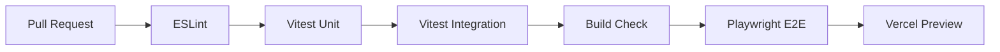

# 🧪 Estratégia de Testes — TEG+ ERP

---

## Filosofia

```
                    ┌─────────┐
                   │  E2E     │ ← Poucos, lentos, alto valor
                  │ Playwright │
                 ├─────────────┤
                │  Integração   │ ← Hooks + Supabase mocks
               │   Vitest + MSW │
              ├─────────────────┤
             │  Unitários        │ ← Muitos, rápidos, funções puras
            │  Vitest             │
           └───────────────────────┘
```

**Regra**: Testar o que quebra em produção. Não testar por vaidade de cobertura.

---

## Stack de Testes

| Ferramenta | Tipo | Uso |
|------------|------|-----|
| **Vitest** | Unit + Integration | Hooks, utils, lógica de negócio |
| **React Testing Library** | Component | Renderização e interação |
| **MSW** (Mock Service Worker) | API Mock | Simular Supabase e n8n |
| **Playwright** | E2E | Fluxos críticos de ponta a ponta |
| **GitHub Actions** | CI | Rodar testes em cada PR |

---

## O que testar (por prioridade)

### 🔴 Prioridade Alta — DEVE ter teste

| Área | Exemplo | Tipo |
|------|---------|------|
| Formatação de datas | `safeDate()`, `fmtData()` com timezone | Unit |
| Cálculos financeiros | Parcelas, totais, impostos | Unit |
| Regras de negócio | `deveContrato()`, alçadas | Unit |
| Hooks de mutation | `useAprovarRequisicao`, `useCriarContrato` | Integration |
| Fluxo de login | Login → dashboard → módulo | E2E |
| Fluxo de aprovação | Criar requisição → aprovar → PO | E2E |

### 🟡 Prioridade Média — DEVERIA ter teste

| Área | Exemplo | Tipo |
|------|---------|------|
| Componentes com lógica | Filtros, StatusBadge, cards | Component |
| Hooks de query | `useListarContratos`, `useRequisicoes` | Integration |
| Permissões | Acesso por perfil/módulo | Integration |
| Upload de arquivos | Cotação, NF, anexos | Integration |

### 🟢 Prioridade Baixa — PODE ter teste

| Área | Exemplo | Tipo |
|------|---------|------|
| Componentes visuais | Layout, sidebar, header | Component |
| Formatação de texto | Máscaras, labels | Unit |

---

## Estrutura de arquivos de teste

```
src/
├── utils/
│   ├── contratosParcelas.ts
│   └── __tests__/
│       └── contratosParcelas.test.ts
├── hooks/
│   ├── useContratos.ts
│   └── __tests__/
│       └── useContratos.test.ts
├── pages/
│   └── contratos/
│       └── __tests__/
│           └── ContratoDetalhe.test.tsx
tests/
├── e2e/
│   ├── login.spec.ts
│   ├── requisicao-flow.spec.ts
│   └── aprovacao-flow.spec.ts
└── setup/
    └── msw-handlers.ts
```

---

## Exemplos

### Teste unitário — Formatação de data

```typescript
import { describe, it, expect } from 'vitest'

const safeDate = (d: string) =>
  new Date(d.length === 10 ? d + 'T12:00:00' : d)

const fmtData = (d: string) =>
  safeDate(d).toLocaleDateString('pt-BR', {
    day: '2-digit', month: '2-digit', year: 'numeric'
  })

describe('fmtData', () => {
  it('formata date-only sem shift de timezone', () => {
    expect(fmtData('2026-04-08')).toBe('08/04/2026')
  })

  it('formata datetime completo', () => {
    expect(fmtData('2026-04-08T15:30:00')).toBe('08/04/2026')
  })
})
```

### Teste unitário — Regra deveContrato

```typescript
describe('deveContrato', () => {
  const deveContrato = (catTipo: string, valor: number, isRecorrente: boolean) =>
    isRecorrente || (catTipo === 'servico' && valor > 2000)

  it('true para recorrente', () => {
    expect(deveContrato('material', 500, true)).toBe(true)
  })

  it('true para serviço > R$2000', () => {
    expect(deveContrato('servico', 2500, false)).toBe(true)
  })

  it('false para serviço <= R$2000', () => {
    expect(deveContrato('servico', 2000, false)).toBe(false)
  })

  it('false para material não recorrente', () => {
    expect(deveContrato('material', 5000, false)).toBe(false)
  })
})
```

### Teste E2E — Fluxo de login (Playwright)

```typescript
import { test, expect } from '@playwright/test'

test('login com credenciais válidas', async ({ page }) => {
  await page.goto('/')
  await page.fill('[name="email"]', 'teste@teg.com')
  await page.fill('[name="password"]', 'senha-teste')
  await page.click('button[type="submit"]')
  
  await expect(page).toHaveURL(/\/dashboard/)
  await expect(page.locator('text=Bem-vindo')).toBeVisible()
})
```

---

## Cobertura mínima

| Área | Meta | Atual |
|------|------|-------|
| Utils/helpers | 90% | 🔴 0% |
| Hooks (lógica) | 70% | 🔴 0% |
| Componentes críticos | 50% | 🔴 0% |
| E2E fluxos principais | 5 fluxos | 🔴 0 |

> ⚠️ Estado atual: sem testes automatizados (ver [[ISSUE-005 - Ausencia de testes automatizados]])

---

## CI/CD Pipeline



### GitHub Actions (futuro)

```yaml
# .github/workflows/test.yml
name: Tests
on: [pull_request]
jobs:
  test:
    runs-on: ubuntu-latest
    steps:
      - uses: actions/checkout@v4
      - uses: actions/setup-node@v4
      - run: npm ci
      - run: npm run test        # Vitest
      - run: npm run test:e2e    # Playwright
```

---

## Links

- [[36 - Guia de Contribuição]] — Padrões de código
- [[15 - Deploy e GitHub]] — CI/CD atual
- [[ISSUE-005 - Ausencia de testes automatizados]] — Issue rastreando
- [[TASK-030 - Testes CI CD]] — Tarefa no roadmap
