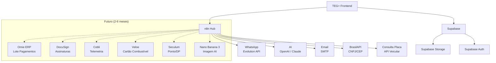

# 🔗 Mapa de Integrações — TEG+ ERP

> Visão unificada de todos os sistemas externos conectados ao TEG+.

---

## Visão Geral



---

## Integrações Ativas

### 1. n8n — Hub de Automações e Parses

| Item | Detalhe |
|------|---------|
| **Status** | ✅ Ativo |
| **Tipo** | Orquestrador central |
| **Infraestrutura** | EasyPanel (Docker) |
| **Uso** | Parses AI, consultas externas, notificações, workflows de aprovação |

**Webhooks de parse ativos:**

| Webhook | Função | Módulo |
|---------|--------|--------|
| `/webhook/compras/parse-cotacao` | Extração AI de dados de PDF/imagem de cotação | Compras |
| `/webhook/consulta-cnpj` | Busca dados de empresa por CNPJ | Cadastros |
| `/webhook/consulta-cep` | Busca endereço por CEP | Cadastros, Logística |
| `/webhook/consulta-placa` | Busca dados de veículo por placa | Frotas |
| `/webhook/superteg/chat` | Agente conversacional SuperTEG | Sistema |
| `/webhook/contrato-analise` | Análise AI de minuta contratual | Contratos |
| `/webhook/nf-parse` | Parse de XML de NF-e | Fiscal |
| `/webhook/cadastro-ai` | Enriquecimento AI de cadastro | Cadastros |

Ver [[38 - Mapa de APIs]] para payloads detalhados.

---

### 2. BrasilAPI / ReceitaWS — Consultas CNPJ/CPF

| Item | Detalhe |
|------|---------|
| **Status** | ✅ Ativo |
| **Tipo** | REST com fallback chain |
| **Fluxo** | n8n proxy → BrasilAPI → ReceitaWS (fallback) |

**Cadeia de fallback:**
1. **Primário**: n8n webhook `/consulta-cnpj` (cache + monitoramento)
2. **Fallback 1**: BrasilAPI (`brasilapi.com.br/api/cnpj/v1/{cnpj}`)
3. **Fallback 2**: ReceitaWS (`receitaws.com.br/v1/cnpj/{cnpj}`) — apenas sócios

**Dados retornados**: razão social, nome fantasia, situação, endereço, telefone, email, sócios, representante legal

**Hook frontend**: `useConsultaCNPJ(onResult?)` — auto-preenche formulários no blur, cache local

---

### 3. Consulta de Placa — Dados Veiculares

| Item | Detalhe |
|------|---------|
| **Status** | ✅ Ativo |
| **Tipo** | Via n8n webhook |
| **Webhook** | `/webhook/consulta-placa` |
| **Dados** | Marca, modelo, ano, combustível, categoria |
| **Módulo** | Frotas |

---

### 4. WhatsApp — Notificações

| Item | Detalhe |
|------|---------|
| **Status** | ✅ Ativo |
| **Tipo** | Envio via n8n |
| **API** | Evolution API (self-hosted) |
| **Uso** | Notificações de aprovação, alertas |

**Fluxo:**

```
Aprovação pendente → n8n → Evolution API → WhatsApp do aprovador
Aprovador clica "Aprovar" → Webhook → n8n → Supabase (registra decisão)
```

---

### 5. AI (OpenAI / Claude / Gemini)

| Item | Detalhe |
|------|---------|
| **Status** | ✅ Ativo |
| **Tipo** | Chamadas via n8n |
| **APIs** | OpenAI (GPT-4), Anthropic (Claude), Google (Gemini 2.5 Flash) |
| **Uso** | Parse cotações, análise contratos, chat SuperTEG, cadastros AI |

**Casos de uso:**

| Feature | Modelo | Input | Output |
|---------|--------|-------|--------|
| Upload Cotação | Gemini 2.5 Flash | PDF/imagem | Itens + valores extraídos |
| Resumo Executivo | Claude | Minuta contrato | Riscos, oportunidades, recomendação |
| SuperTEG Chat | Claude | Pergunta em linguagem natural | Resposta contextualizada + ações |
| Cadastro AI | GPT-4 | Dados parciais | Dados enriquecidos (CNPJ, endereço) |

Ver [[49 - SuperTEG AI Agent]] para documentação completa do agente.

---

### 6. Email (SMTP)

| Item | Detalhe |
|------|---------|
| **Status** | ✅ Ativo |
| **Tipo** | Envio via n8n |
| **Uso** | Magic links, notificações, relatórios |

---

## Integrações Futuras

### 7. Omie ERP — Lote de Pagamentos e Conciliação (~2 meses)

| Item | Detalhe |
|------|---------|
| **Status** | ⏳ Futuro (~Jun 2026) |
| **Tipo** | Bidirecional via n8n |
| **API** | REST — `app.omie.com.br/api/v1/` |
| **Auth** | App Key + App Secret |
| **Rate limit** | 3 req/s |
| **Escopo** | Emissão de lote de pagamentos + conciliação bancária |

**Escopo definido (NÃO é sync bidirecional completo):**
- Emissão de lotes de contas a pagar para pagamento em massa
- Conciliação de pagamentos (TEG+ ↔ Omie)
- **NÃO inclui**: sync de cadastros, fiscal geral, CR

Ver [[19 - Integração Omie]] para mapeamento de campos (preparatório).

---

### 8. DocuSign — Assinaturas Digitais

| Item | Detalhe |
|------|---------|
| **Status** | ⏳ Futuro |
| **Tipo** | Via API DocuSign |
| **Módulo** | Contratos |
| **Objetivo** | Assinatura digital de contratos e aditivos |
| **Fluxo previsto** | Contrato aprovado → envelope DocuSign → coleta assinaturas → callback status |

---

### 9. Cobli — Telemetria Veicular

| Item | Detalhe |
|------|---------|
| **Status** | ⏳ Futuro |
| **Tipo** | API Cobli |
| **Módulo** | Frotas |
| **Objetivo** | Telemetria em tempo real (GPS, velocidade, consumo, alertas) |
| **Dados** | Posição GPS, odômetro, eventos de direção, cercas eletrônicas |

---

### 10. Veloe — Cartão Combustível

| Item | Detalhe |
|------|---------|
| **Status** | ⏳ Futuro |
| **Tipo** | API Veloe |
| **Módulo** | Frotas |
| **Objetivo** | Integração de abastecimentos via cartão Veloe |
| **Dados** | Transações de abastecimento, litros, posto, valor, veículo |

---

### 11. Seculum — Ponto Eletrônico

| Item | Detalhe |
|------|---------|
| **Status** | ⏳ Futuro |
| **Tipo** | API Seculum |
| **Módulo** | RH / DP |
| **Objetivo** | Integração de batidas de ponto com módulo de Departamento Pessoal |
| **Dados** | Registros de ponto, horas trabalhadas, banco de horas, faltas |

---

### 12. Nano Banana 3 — Geração de Imagem AI

| Item | Detalhe |
|------|---------|
| **Status** | ⏳ Futuro |
| **Tipo** | API de geração de imagem |
| **Módulo** | Sistema / Marketing |
| **Objetivo** | Geração de imagens AI para comunicação interna, endomarketing, mural |

---

### 13. Bancos — CNAB/PIX

| Item | Detalhe |
|------|---------|
| **Status** | ⬜ Backlog |
| **Tipo** | Arquivo CNAB 240/400 + API PIX |
| **Objetivo** | Remessa de pagamento automática, conciliação |
| **Requisito** | [[REQ-010 - Conciliacao e Remessa Bancaria]] |

---

## Monitoramento de Integrações

| Integração | Onde monitorar | Alerta |
|------------|---------------|--------|
| n8n Parses | n8n Executions | Falha 3x consecutivas |
| CNPJ/CEP/Placa | n8n Executions | Timeout > 10s |
| WhatsApp | Evolution API dashboard | Desconexão da sessão |
| AI | n8n Executions | Timeout > 30s |
| Email | n8n Executions | Bounce / falha SMTP |

---

## Resumo de Status

| Integração | Status | Módulo |
|------------|--------|--------|
| n8n Parses (cotação, NF, cadastro) | ✅ Ativo | Multi |
| BrasilAPI / CNPJ | ✅ Ativo | Cadastros |
| Consulta Placa | ✅ Ativo | Frotas |
| WhatsApp (Evolution) | ✅ Ativo | Aprovações |
| AI (OpenAI/Claude/Gemini) | ✅ Ativo | Multi |
| Email SMTP | ✅ Ativo | Sistema |
| SuperTEG (agente AI) | ✅ Ativo | Sistema |
| Omie ERP | ⏳ ~Jun 2026 | Financeiro |
| DocuSign | ⏳ Futuro | Contratos |
| Cobli | ⏳ Futuro | Frotas |
| Veloe | ⏳ Futuro | Frotas |
| Seculum | ⏳ Futuro | RH/DP |
| Nano Banana 3 | ⏳ Futuro | Sistema |
| Bancos CNAB/PIX | ⬜ Backlog | Financeiro |

---

## Links

- [[10 - n8n Workflows]] — Detalhes dos workflows
- [[19 - Integração Omie]] — Mapeamento Omie (preparatório)
- [[38 - Mapa de APIs]] — Todos os endpoints e payloads
- [[43 - Runbook de Incidentes]] — O que fazer quando falha
- [[49 - SuperTEG AI Agent]] — Agente AI conversacional
- [[50 - Fluxos Inter-Módulos]] — Como os módulos se conectam
