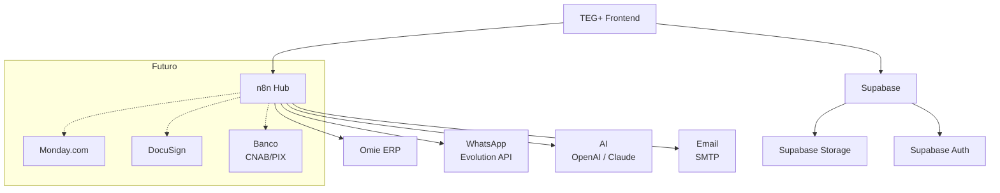

# 🔗 Mapa de Integrações — TEG+ ERP

> Visão unificada de todos os sistemas externos conectados ao TEG+.

---

## Visão Geral



---

## Integrações Ativas

### 1. Omie ERP — Contabilidade e Fiscal

| Item | Detalhe |
|------|---------|
| **Status** | ✅ Ativo |
| **Tipo** | Bidirecional via n8n |
| **API** | REST — `app.omie.com.br/api/v1/` |
| **Auth** | App Key + App Secret |
| **Rate limit** | 3 req/s |
| **Módulos** | Financeiro (CP, CR), Fiscal (NF), Cadastros |

**Fluxo de dados:**

```
TEG+ (CP criado) → n8n → Omie (lançamento)
Omie (pagamento confirmado) → n8n → TEG+ (status atualizado)
```

**Fallback**: Se Omie offline, n8n enfileira e retenta em 5 min (3x).

Ver [[19 - Integração Omie]] para mapeamento completo de campos.

---

### 2. WhatsApp — Notificações

| Item | Detalhe |
|------|---------|
| **Status** | ✅ Ativo |
| **Tipo** | Envio via n8n |
| **API** | Evolution API (self-hosted) |
| **Uso** | Notificações de aprovação, alertas |

**Fluxo:**

```
Aprovação pendente → n8n → Evolution API → WhatsApp do aprovador
Aprovador clica "Aprovar" → Webhook → n8n → Supabase (registra decisão)
```

---

### 3. AI (OpenAI / Claude)

| Item | Detalhe |
|------|---------|
| **Status** | ✅ Ativo |
| **Tipo** | Chamadas via n8n |
| **APIs** | OpenAI (GPT-4), Anthropic (Claude) |
| **Uso** | Parse cotações, análise contratos, chat SuperTEG, cadastros AI |

**Casos de uso:**

| Feature | Modelo | Input | Output |
|---------|--------|-------|--------|
| Upload Cotação | GPT-4 Vision | PDF/imagem | Itens + valores extraídos |
| Resumo Executivo | Claude | Minuta contrato | Riscos, oportunidades, recomendação |
| SuperTEG Chat | Claude | Pergunta em linguagem natural | Resposta contextualizada |
| Cadastro AI | GPT-4 | Dados parciais | Dados enriquecidos (CNPJ, endereço) |

---

### 4. Email (SMTP)

| Item | Detalhe |
|------|---------|
| **Status** | ✅ Ativo |
| **Tipo** | Envio via n8n |
| **Uso** | Magic links, notificações, relatórios |

---

## Integrações Planejadas

### 5. Monday.com — PMO (Q4-2026)

| Item | Detalhe |
|------|---------|
| **Status** | ⬜ Backlog |
| **Tipo** | Bidirecional via n8n |
| **Objetivo** | Gestão de portfólio das 6 obras |
| **Milestone** | [[MS-013 - Monday PMO]] |

---

### 6. DocuSign — Assinaturas Digitais

| Item | Detalhe |
|------|---------|
| **Status** | ⬜ Backlog |
| **Tipo** | Via API DocuSign |
| **Objetivo** | Assinatura digital de contratos |

---

### 7. Bancos — CNAB/PIX

| Item | Detalhe |
|------|---------|
| **Status** | ⬜ Backlog |
| **Tipo** | Arquivo CNAB 240/400 + API PIX |
| **Objetivo** | Remessa de pagamento automática, conciliação |
| **Requisito** | [[REQ-010 - Conciliacao e Remessa Bancaria]] |

---

## Monitoramento de Integrações

| Integração | Onde monitorar | Alerta |
|------------|---------------|--------|
| Omie | n8n Executions | Falha 3x consecutivas |
| WhatsApp | Evolution API dashboard | Desconexão da sessão |
| AI | n8n Executions | Timeout > 30s |
| Email | n8n Executions | Bounce / falha SMTP |

---

## Links

- [[10 - n8n Workflows]] — Detalhes dos workflows
- [[19 - Integração Omie]] — Mapeamento Omie
- [[38 - Mapa de APIs]] — Todos os endpoints
- [[43 - Runbook de Incidentes]] — O que fazer quando falha
- [[MS-013 - Monday PMO]] — Integração Monday (futuro)
