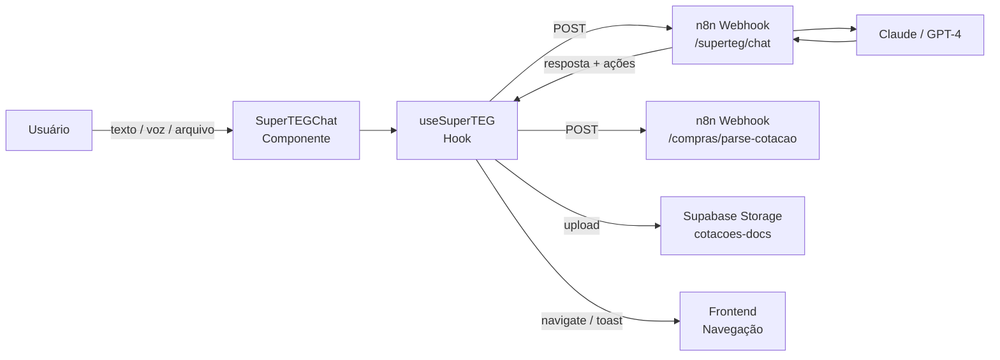
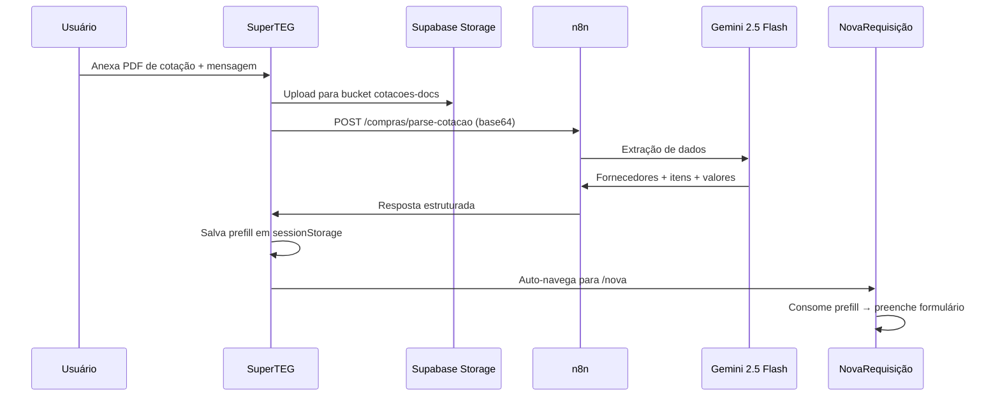

# 🤖 SuperTEG — Agente AI Conversacional

> Assistente inteligente integrado ao TEG+ ERP. Responde perguntas, executa ações, e faz parse de documentos via chat.

---

## Visão Geral



---

## Componentes

### SuperTEGChat (`components/SuperTEGChat.tsx`)

UI do chat flutuante no canto inferior direito.

| Feature | Detalhe |
|---------|---------|
| **Ativação** | Botão flutuante com ícone Sparkles |
| **Tamanho desktop** | 420px × 640px |
| **Tamanho mobile** | Full-screen |
| **Quick actions** | Chips: "Resumo", "Requisições", "Pedidos", "Ajuda" |
| **Voz** | Gravação de áudio com transcrição em tempo real |
| **Arquivos** | Upload de PDF, Excel, CSV, imagens, Word |
| **Indicador** | Ponto verde quando há conversa ativa |

### useSuperTEG (`hooks/useSuperTEG.ts`)

Hook principal com 3 métodos de entrada:

| Método | Input | Uso |
|--------|-------|-----|
| `sendMessage(text)` | Texto livre | Perguntas, comandos |
| `sendAudio(blob, transcript)` | Áudio base64 + transcrição | Mensagens de voz |
| `sendMessageWithFile(text, file)` | Texto + arquivo | Parse de cotações, documentos |

---

## Fluxo de Chat

```
1. Usuário digita/fala/anexa arquivo
2. useSuperTEG envia POST para /webhook/superteg/chat
3. n8n processa com Claude (contexto: sessão + histórico)
4. Resposta retorna com texto + ações opcionais
5. Frontend renderiza resposta e executa ações
```

### Gestão de Sessão

- **Armazenamento**: `sessionStorage` (limpo ao fechar aba)
- **Histórico**: Máximo 20 mensagens por sessão
- **Session ID**: UUID gerado no início da conversa

---

## Ações Automáticas

O SuperTEG pode retornar ações estruturadas junto com a resposta:

| Ação | Tipo | Descrição |
|------|------|-----------|
| `navigate` | Navegação | Redireciona para uma página do ERP |
| `notify_admins` | Notificação | Alerta administradores |
| `open_url` | Link externo | Abre URL em nova aba |

**Auto-navegação**: Quando a resposta contém exatamente 1 ação `navigate`, o sistema navega automaticamente após 500ms com um toast de confirmação.

**Detecção de links**: Links markdown na resposta (`[texto](/caminho)`) são automaticamente convertidos em ações de navegação.

---

## Parse de Documentos (Upload Inteligente)

### Fluxo de Parse via SuperTEG



### Dados Extraídos

```typescript
{
  descricao: string,              // Descrição sugerida da requisição
  cotacao_referencia_url: string,  // URL do arquivo no Storage
  cotacao_referencia_nome: string, // Nome do arquivo original
  mensagem_usuario: string,       // Texto que o usuário enviou
  fornecedores: [{
    fornecedor_nome: string,
    fornecedor_cnpj?: string,
    valor_total: number,
    prazo_entrega_dias?: number,
    condicao_pagamento?: string,
    itens: [{
      descricao: string,
      qtd: number,
      valor_unitario: number,
      valor_total: number,
      match_status?: 'auto_match' | 'review' | 'unmatched'
    }]
  }],
  parser_confidence?: number       // 0-1, confiança da extração
}
```

### Consumo do Prefill (NovaRequisição)

O componente `NovaRequisicao.tsx` consome o prefill automaticamente:
1. `useEffect` verifica `sessionStorage['superteg-prefill-rc']`
2. Popula itens com limpeza inteligente de nomes
3. Pula para step 2 (detalhes) se itens extraídos com sucesso
4. Pré-preenche descrição e justificativa

---

## Tipos de Arquivo Suportados

| Tipo | Extensões | Uso |
|------|-----------|-----|
| PDF | `.pdf` | Cotações, contratos, NFs |
| Imagem | `.png`, `.jpg`, `.jpeg` | Fotos de cotações |
| Excel | `.xlsx`, `.xls` | Planilhas de preços |
| CSV | `.csv` | Dados tabulares |
| Word | `.doc`, `.docx` | Minutas, relatórios |

---

## Exemplos de Uso

| Pergunta/Ação | Resposta esperada |
|---------------|-------------------|
| "Quantas requisições pendentes?" | Conta e lista com links |
| "Me leva para o financeiro" | Navega para `/financeiro` |
| "Qual o status do pedido PO-2026-0042?" | Busca e retorna status |
| *Anexa PDF de cotação* | Extrai dados → cria requisição pré-preenchida |
| "Quem são os aprovadores de compras?" | Lista aprovadores com alçadas |
| "Resumo do dia" | KPIs e alertas pendentes |

---

## Configuração

| Variável | Valor |
|----------|-------|
| Webhook URL | `VITE_N8N_WEBHOOK_URL` + `/superteg/chat` |
| Storage bucket | `cotacoes-docs` |
| Modelo principal | Claude (via n8n) |
| Modelo de parse | Gemini 2.5 Flash (via n8n) |
| Max histórico | 20 mensagens por sessão |

---

## Links

- [[26 - Upload Inteligente Cotacao]] — Parse de cotações detalhado
- [[10 - n8n Workflows]] — Workflows do n8n
- [[38 - Mapa de APIs]] — Endpoints e payloads
- [[45 - Mapa de Integrações]] — Integrações AI
- [[50 - Fluxos Inter-Módulos]] — Fluxos entre módulos
