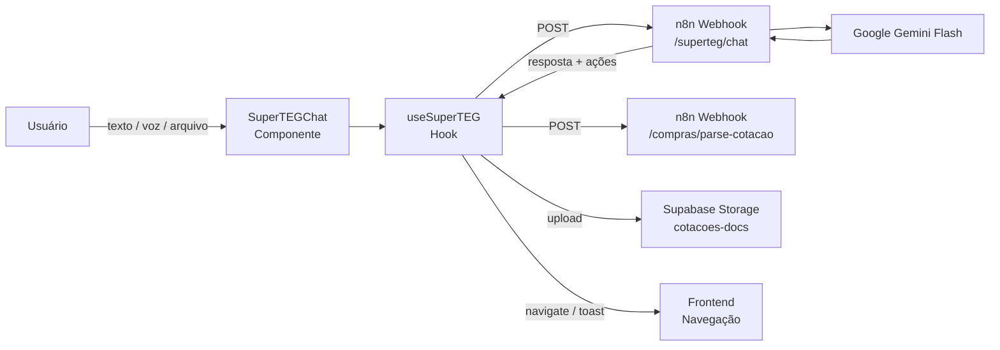
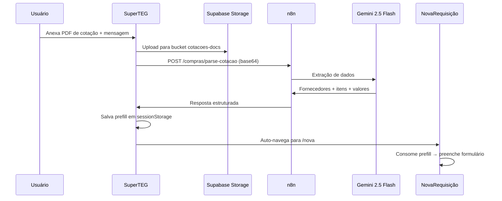

# 🤖 SuperTEG Atendimento — Assistente do usuário

> Assistente do usuário dentro do TEG+ (widget no canto da tela). Responde dúvidas, navega entre telas, registra feedback e faz parse de documentos.

> ⚠️ **Não confundir com o outro SuperTEG.** Este é o **Atendimento**: workflow n8n com Gemini, voltado ao usuário. O outro é o **worker operacional** (Claude Code na VPS, `superteg-server.mjs`) que executa tarefas pesadas — extração de PDF, OneDrive, análises. São dois sistemas diferentes com o mesmo nome de família.

---

## Visão Geral



---

## Componentes

### SuperTEGChat (`components/SuperTEGChat.tsx`)

UI do chat flutuante no canto inferior direito.

| Feature | Detalhe |
|---------|---------|
| **Ativação** | Botão flutuante com ícone Sparkles |
| **Tamanho desktop** | 420px × 640px |
| **Tamanho mobile** | Full-screen |
| **Quick actions** | Chips: "Resumo", "Requisições", "Pedidos", "Ajuda" |
| **Voz** | Gravação de áudio com transcrição em tempo real |
| **Arquivos** | Upload de PDF, Excel, CSV, imagens, Word |
| **Indicador** | Ponto verde quando há conversa ativa |

### useSuperTEG (`hooks/useSuperTEG.ts`)

Hook principal com 3 métodos de entrada:

| Método | Input | Uso |
|--------|-------|-----|
| `sendMessage(text)` | Texto livre | Perguntas, comandos |
| `sendAudio(blob, transcript)` | Áudio base64 + transcrição | Mensagens de voz |
| `sendMessageWithFile(text, file)` | Texto + arquivo | Parse de cotações, documentos |

---

## Fluxo de Chat

```
1. Usuário digita/fala/anexa arquivo
2. useSuperTEG envia POST para /webhook/superteg/chat
3. n8n processa com Claude (contexto: sessão + histórico)
4. Resposta retorna com texto + ações opcionais
5. Frontend renderiza resposta e executa ações
```

### Gestão de Sessão

- **Armazenamento**: `sessionStorage` (limpo ao fechar aba)
- **Histórico**: Máximo 20 mensagens por sessão
- **Session ID**: UUID gerado no início da conversa

---

## Ações Automáticas

O SuperTEG pode retornar ações estruturadas junto com a resposta:

| Ação | Tipo | Descrição |
|------|------|-----------|
| `navigate` | Navegação | Redireciona para uma página do ERP |
| `notify_admins` | Notificação | Alerta administradores |
| `open_url` | Link externo | Abre URL em nova aba |

**Auto-navegação**: Quando a resposta contém exatamente 1 ação `navigate`, o sistema navega automaticamente após 500ms com um toast de confirmação.

**Detecção de links**: Links markdown na resposta (`[texto](/caminho)`) são automaticamente convertidos em ações de navegação.

---

## Parse de Documentos (Upload Inteligente)

### Fluxo de Parse via SuperTEG



### Dados Extraídos

```typescript
{
  descricao: string,              // Descrição sugerida da requisição
  cotacao_referencia_url: string,  // URL do arquivo no Storage
  cotacao_referencia_nome: string, // Nome do arquivo original
  mensagem_usuario: string,       // Texto que o usuário enviou
  fornecedores: [{
    fornecedor_nome: string,
    fornecedor_cnpj?: string,
    valor_total: number,
    prazo_entrega_dias?: number,
    condicao_pagamento?: string,
    itens: [{
      descricao: string,
      qtd: number,
      valor_unitario: number,
      valor_total: number,
      match_status?: 'auto_match' | 'review' | 'unmatched'
    }]
  }],
  parser_confidence?: number       // 0-1, confiança da extração
}
```

### Consumo do Prefill (NovaRequisição)

O componente `NovaRequisicao.tsx` consome o prefill automaticamente:
1. `useEffect` verifica `sessionStorage['superteg-prefill-rc']`
2. Popula itens com limpeza inteligente de nomes
3. Pula para step 2 (detalhes) se itens extraídos com sucesso
4. Pré-preenche descrição e justificativa

---

## Tipos de Arquivo Suportados

| Tipo | Extensões | Uso |
|------|-----------|-----|
| PDF | `.pdf` | Cotações, contratos, NFs |
| Imagem | `.png`, `.jpg`, `.jpeg` | Fotos de cotações |
| Excel | `.xlsx`, `.xls` | Planilhas de preços |
| CSV | `.csv` | Dados tabulares |
| Word | `.doc`, `.docx` | Minutas, relatórios |

---

## Exemplos de Uso

| Pergunta/Ação | Resposta esperada |
|---------------|-------------------|
| "Quantas requisições pendentes?" | Conta e lista com links |
| "Me leva para o financeiro" | Navega para `/financeiro` |
| "Qual o status do pedido PO-2026-0042?" | Busca e retorna status |
| *Anexa PDF de cotação* | Extrai dados → cria requisição pré-preenchida |
| "Quem são os aprovadores de compras?" | Lista aprovadores com alçadas |
| "Resumo do dia" | KPIs e alertas pendentes |

---

## Configuração

| Variável | Valor |
|----------|-------|
| Webhook URL | `VITE_N8N_WEBHOOK_URL` + `/superteg/chat` |
| Storage bucket | `cotacoes-docs` |
| Workflow n8n | `KJUlWGP1ItQkUQOB` — "TEG+ \| SuperTEG Atendimento" (ativo) |
| Modelo principal | Google Gemini Flash (via n8n) |
| Modelo de parse | Gemini 2.5 Flash (via n8n) |
| Max histórico | 20 mensagens por sessão |

---

## ⚠️ Onde vive o mapa de navegação

> **O mapa de módulos/telas NÃO está no repositório.** Ele é o campo `parameters.options.systemMessage` do nó **"SuperTEG Agent"** dentro do workflow n8n `KJUlWGP1ItQkUQOB`, seção **§NAVEGAÇÃO — Mapa de Módulos**. Editar o código do TEG+ não muda nada aqui.

O agente **não chama ferramenta para navegar**: responde com link markdown `[Label](/rota)` e o frontend intercepta e navega. As regras R1–R10 classificam a intenção (NAVEGAÇÃO / CADASTRO / FEEDBACK / CONSULTA / KPI).

### Como atualizar

1. `GET /api/v1/workflows/KJUlWGP1ItQkUQOB` (header `X-N8N-API-KEY`) — **guardar o systemMessage atual como backup**, não há histórico de versões.
2. Extrair os rótulos e rotas **reais** dos `src/components/*Layout.tsx` — nunca chutar.
3. Editar o `systemMessage` do nó "SuperTEG Agent".
4. Validar: toda rota citada tem que existir em `App.tsx` (comparar as duas listas).
5. `PUT` de volta com **body mínimo**: `{name, nodes, connections, settings}`.

> ⚠️ **`settings` só aceita chaves do schema público** (`executionOrder`, `timezone`, `saveExecution*`, `executionTimeout`, `errorWorkflow`). Mandar o objeto inteiro de volta dá **HTTP 400**.

> ⚠️ **Vale na hora.** O workflow está ativo; a próxima pergunta de qualquer usuário já usa o texto novo. Não há homologação nem rollback automático.

### Armadilhas do prompt

- **"melhoria" sozinho = FEEDBACK**, mas **"melhoria contínua" = NAVEGAÇÃO** (`/sgi/melhoria`). Distinguir pelo verbo: ir/abrir/ver → navegação.
- **"alocação" é ambíguo**: Frotas (`/frotas/frota`) × Obras (`/obras/equipe`, `/obras/alocacao-recursos`). O prompt manda **perguntar** quando não der para saber.
- **EGP tem 4 telas de topo** (Painel, Iniciação, Gestão de Projetos, Encerramento). `Controle` está **oculto** no `EGPLayout`; cronograma/EAP/medições são sub-abas de `/egp/planejamento`.

### Revisão de 2026-08-03

Auditoria do mapa contra o `App.tsx` (180 rotas reais × 106 citadas):

| Problema | Correção |
|---|---|
| `/ti/novo`, `/ti/meus`, `/ti/fila` — **3 rotas mortas**, links quebrados | Menu real de TI: `/ti`, `/ti/chamados`, `/ti/chamados/novo`, `/ti/ativos`, `/ti/base`, `/ti/termos` |
| Frotas com o rótulo antigo **"Frota & Máquinas"** e ordem errada | Menu real: Painel \| Operação \| Manutenção \| **Alocação** (`/frotas/frota`) |
| `/obras/gestao` ausente (é o 2º item do menu de Obras) | Acrescentado, com as 4 abas na descrição |
| Monitoramento e AprovaAí **fora do mapa** | Acrescentados |
| QSMA descrito sem OS, matriz de EPC e Ficha de EPI | Descrição atualizada |

`systemMessage`: 11.200 → 12.458 chars. **Validado: as 114 rotas citadas existem em `App.tsx`.**

Falsos positivos da auditoria — `/apontamentos`, `/egp/tap`, `/egp/reunioes`, `/egp/indicadores` são **redirects**, não telas; não entram no mapa.

---

## Módulos Novos (Atualização 2026-04)

O system prompt do SuperTEG foi atualizado para incluir:

### Telemetria (Logística)
- Mapa ao vivo GPS via Cobli (`/logistica/telemetria`)
- Alertas de velocidade, frenagem brusca
- KM rodada e utilização por veículo

### Cautelas (Estoque)
- Empréstimo/devolução de materiais (`/estoque/cautelas`)
- Nova cautela (`/estoque/cautelas/nova`)
- Minhas cautelas (`/minhas-cautelas`)

### QR Code (Patrimonial)
- Scanner QR no celular (`/patrimonial/scanner`)
- Ficha do ativo com timeline (`/p/{numero}`)
- Etiqueta PDF para impressão

### Manutenção Preventiva (Frotas)
- Planos por tipo de veículo (`/frotas/manutencao` → Planejamento)
- 9 itens rastreados: óleo, filtros, pneus, freios, bateria, suspensão, correia, fluido
- KM automático via telemetria Cobli
- Checklists por veículo com alertas de troca

### KPIs Cruzados (Frotas)
- Custo/km por veículo (abastecimento + manutenção ÷ km telemetria)
- Consumo real km/L
- Score de motoristas (ocorrências ÷ km)
- Painel de Motoristas via select no header do Dashboard Frotas

---

## Links

- [[26 - Upload Inteligente Cotacao]] — Parse de cotações detalhado
- [[10 - n8n Workflows]] — Workflows do n8n
- [[38 - Mapa de APIs]] — Endpoints e payloads
- [[45 - Mapa de Integrações]] — Integrações AI
- [[50 - Fluxos Inter-Módulos]] — Fluxos entre módulos
