# 🔄 Fluxos Inter-Módulos — TEG+ ERP

> Como os 16 módulos do TEG+ se conectam entre si. Cada fluxo descreve o caminho dos dados desde a origem até o destino final.

---

## Mapa de Conexões

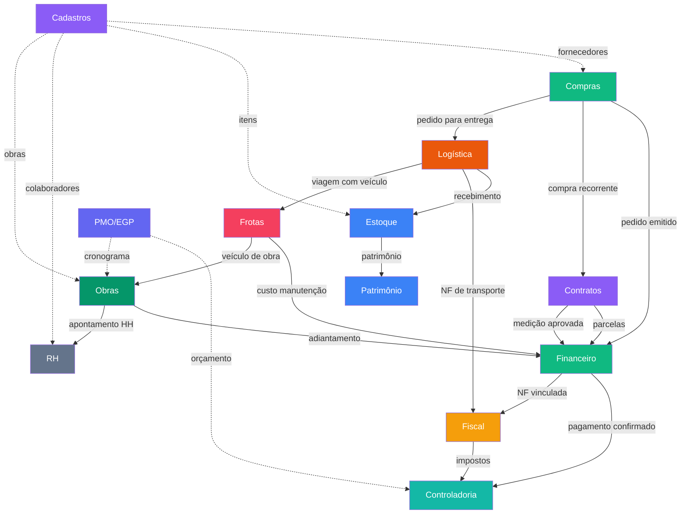

---

## Fluxo 1: Compras → Financeiro (Requisição ao Pagamento)

O fluxo principal do sistema — da necessidade de compra ao pagamento do fornecedor.

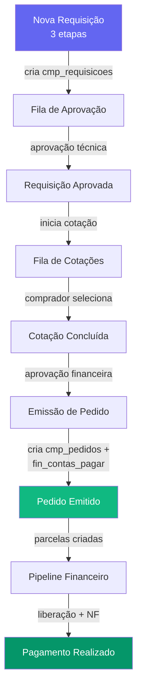

### Timeline de 7 Estágios (FluxoTimeline)

| Estágio | Status | Módulo |
|---------|--------|--------|
| 1. Requisição | rascunho → pendente → em_esclarecimento | Compras |
| 2. Validação Técnica | em_aprovacao → aprovada | Aprovações |
| 3. Cotação | em_cotacao → cotacao_enviada | Compras |
| 4. Aprovação Financeira | cotacao_aprovada | Aprovações |
| 5. Pedido | pedido_emitido → aguardando_contrato | Compras |
| 6. Entrega | em_entrega → entregue | Logística |
| 7. Pagamento | aguardando_pgto → pago | Financeiro |

### Dados que cruzam módulos

| Origem | Destino | Dados | Tabelas |
|--------|---------|-------|---------|
| Pedido emitido | Contas a Pagar | Parcelas com valor, vencimento, classe financeira, centro de custo | `cmp_pedidos` → `fin_contas_pagar` |
| NF recebida | Financeiro | Número NF, valor, CNPJ fornecedor | `fis_notas_fiscais` → `fin_contas_pagar.nf_numero` |
| Pagamento confirmado | Controladoria | Valor realizado vs orçado | `fin_contas_pagar` → DRE |

---

## Fluxo 2: Compras → Contratos (Compra Recorrente)

Quando uma requisição é recorrente ou de serviço acima de R$ 2.000, o pedido solicita um contrato.

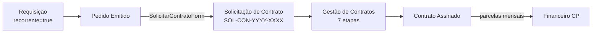

### Regra de Obrigatoriedade (ADR-010)

`deveContrato = true` quando:
- Tipo = **recorrente**, OU
- Tipo = **serviço** E valor estimado > **R$ 2.000**

### Dados cruzados

| Campo | Origem | Destino |
|-------|--------|---------|
| `requisicao_origem_id` | `cmp_requisicoes.id` | `con_contratos.requisicao_origem_id` |
| `valor_mensal` | Pedido | Contrato |
| `prazo_meses` | Pedido | Contrato |

---

## Fluxo 3: Logística → Estoque (Recebimento)

Quando um pedido chega fisicamente na obra, o fluxo de recebimento alimenta o estoque.

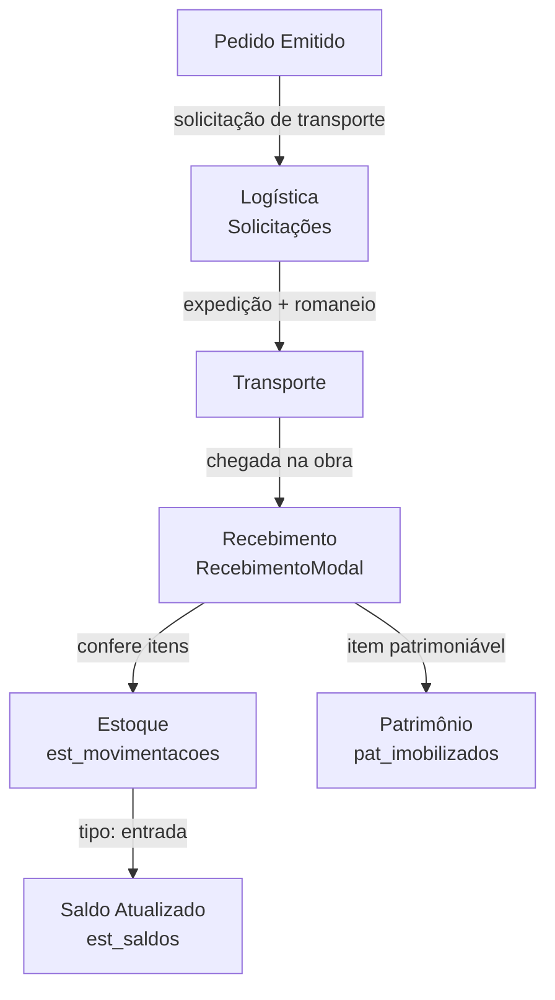

### Pipeline Logístico (9 etapas)

| Etapa | Status | Ação |
|-------|--------|------|
| 1 | pendente | Solicitação criada |
| 2 | aprovada | Aprovação da diretoria |
| 3 | em_separacao | Almoxarifado prepara |
| 4 | romaneio_emitido | Documento fiscal emitido |
| 5 | em_expedicao | Aguardando despacho |
| 6 | em_transito | Motorista na estrada |
| 7 | entregue | Chegou no destino |
| 8 | conferido | Conferência física OK |
| 9 | concluido | Movimentação de estoque criada |

### Viagens (agrupamento)

Múltiplas solicitações podem ser agrupadas em uma **Viagem** (`log_viagens`):
- Numeração: `LOG-V-YYYY-NNNN`
- Rota consolidada com N paradas
- Custo rateado entre solicitações
- Entrega parcial por parada

---

## Fluxo 4: Contratos → Financeiro (Medições)

Contratos geram parcelas financeiras via medições aprovadas.

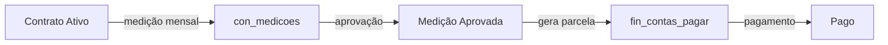

### Dados cruzados

| Campo | Origem | Destino |
|-------|--------|---------|
| `contrato_id` | `con_contratos.id` | `fin_contas_pagar.contrato_id` |
| `valor_medicao` | `con_medicoes.valor` | `fin_contas_pagar.valor` |
| `classe_financeira` | `con_contratos.classe_financeira_id` | `fin_contas_pagar.classe_financeira_id` |

---

## Fluxo 5: Fiscal → Financeiro (NF vinculada ao pagamento)

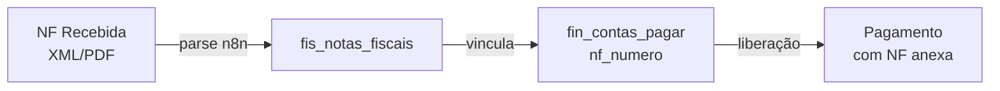

A NF é pré-requisito para liberação de pagamento em muitos casos.

---

## Fluxo 6: Frotas → Financeiro (Custos de Manutenção)

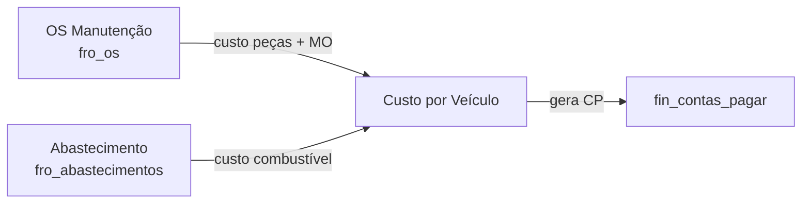

---

## Fluxo 7: Obras → Financeiro (Adiantamentos)

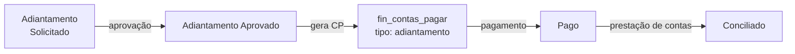

---

## Fluxo 8: Cadastros → Todos os Módulos

O módulo de Cadastros é a **fonte de dados mestre** (master data) para todo o sistema.

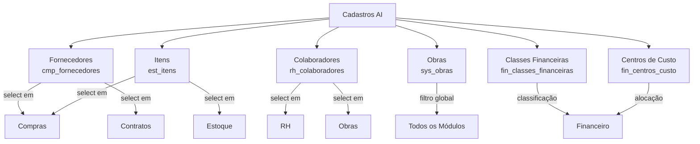

### Enriquecimento AI

Cadastros utilizam AI para enriquecer dados:
- **CNPJ lookup**: Auto-preenche razão social, endereço, sócios
- **CEP lookup**: Auto-preenche endereço
- **MagicModal**: Criação rápida inline (AI ou manual) em qualquer módulo

---

## Fluxo 9: PMO/EGP → Controladoria (Orçamento)

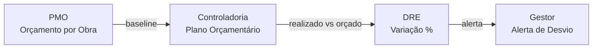

---

## Fluxo 10: SuperTEG → Multi-Módulo

O agente AI SuperTEG interage com múltiplos módulos:

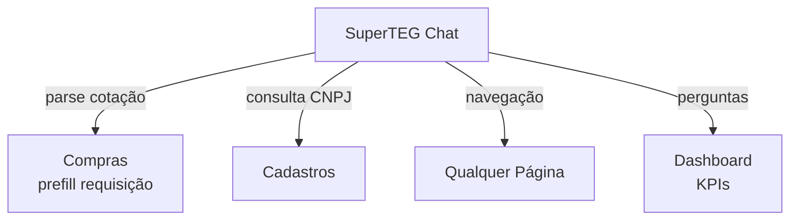

Ver [[49 - SuperTEG AI Agent]] para documentação completa.

---

## Tabela de Referência Cruzada

| Módulo Origem | Módulo Destino | Tabela Ponte | Trigger |
|--------------|---------------|-------------|---------|
| Compras | Financeiro | `fin_contas_pagar` | Emissão de pedido |
| Compras | Contratos | `con_contratos` | Compra recorrente / serviço > R$2k |
| Compras | Logística | `log_solicitacoes` | Pedido para entrega |
| Logística | Estoque | `est_movimentacoes` | Recebimento confirmado |
| Logística | Fiscal | `fis_notas_fiscais` | NF de transporte |
| Contratos | Financeiro | `fin_contas_pagar` | Medição aprovada |
| Fiscal | Financeiro | `fin_contas_pagar.nf_numero` | NF vinculada |
| Frotas | Financeiro | `fin_contas_pagar` | OS concluída |
| Obras | Financeiro | `fin_contas_pagar` | Adiantamento aprovado |
| Obras | RH | `rh_apontamentos` | Apontamento HH |
| Estoque | Patrimônio | `pat_imobilizados` | Item patrimoniável |
| PMO | Controladoria | `ctrl_orcamentos` | Baseline orçamentário |
| Cadastros | Todos | FK refs | Master data |

---

## Links

- [[01 - Arquitetura Geral]] — Visão da arquitetura
- [[11 - Fluxo Requisição]] — Detalhes do fluxo de requisição
- [[12 - Fluxo Aprovação]] — Fluxo de aprovação multi-nível
- [[20 - Módulo Financeiro]] — Pipeline financeiro
- [[21 - Fluxo Pagamento]] — Fluxo de pagamento
- [[23 - Módulo Logística e Transportes]] — Pipeline logístico
- [[27 - Módulo Contratos Gestão]] — Gestão de contratos
- [[49 - SuperTEG AI Agent]] — Agente AI
- [[45 - Mapa de Integrações]] — Integrações externas
