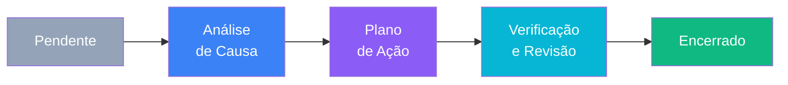
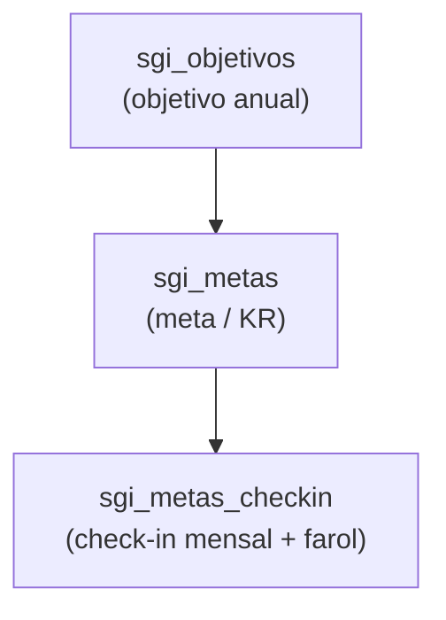

# Módulo Governança / SGI

> Sistema de Gestão Integrado (SGI) — pilar **Governança** do TEG+, criado para superar o SGI360 (referência: matriz RFP CEMIG QSMS). Accent cor **violeta**. Três disciplinas em produção: **Padronização** (controle documental ISO 9001 com versionamento e aprovação), **Melhoria Contínua** (registros + PDCA + análise de causa + ações) e **Objetivos e Metas** (OKR/farol com check-ins). 100% aditivo.

---

## Visão Geral

O SGI organiza governança e qualidade em disciplinas que compartilham a mesma espinha (`sgi_acoes` como backbone de ações corretivas):

1. **Padronização** — documentos ISO 9001 (`sgi_documentos`) com ciclo rascunho→revisão→aprovação→vigente, versionamento e workflow de aprovação. Documentos com `requer_ciencia` viram **Missões** no Portal do colaborador.
2. **Melhoria Contínua (PDCA)** — captação de **registros/ocorrências** (`sgi_registros`), triagem em NC/registro, **análise de causa** (5 Porquês + Ishikawa 6M), **plano de ação** (`sgi_acoes`) e **verificação de eficácia**.
3. **Objetivos e Metas** — objetivos anuais (`sgi_objetivos`) desdobrados em metas/KRs (`sgi_metas`) com **check-ins mensais** (`sgi_metas_checkin`) e **farol**.

> `sgi_acoes` é reutilizada por outros módulos (ex.: QSMA grava ações com `origem_tipo` próprio) — é o registro único de ações corretivas do ERP.

---

## Estrutura de Rotas

Gate: `<ModuleRoute moduleKey="sgi">`. Layout: `SgiLayout` (accent **violeta**). Dashboard via `ResponsivePainel` (desktop `SgiPainel` / mobile `SgiPainelMobile`).

| Rota | Componente | Descrição |
|------|-----------|-----------|
| `/sgi` | `SgiPainel` / `SgiPainelMobile` | Painel executivo de metas/indicadores |
| `/sgi/novo` | `SgiNovoRegistro` | Novo **registro/ocorrência** (entrada do PDCA) |
| `/sgi/objetivos` | `SgiObjetivos` | Objetivos, metas/KRs e check-ins com farol |
| `/sgi/melhoria` | `SgiMelhoriaContinua` | Board PDCA dos registros + ações |
| `/sgi/padronizacao` | `SgiPadronizacao` | Controle documental ISO 9001 |

---

## Disciplina 1 — Padronização (`SgiPadronizacao.tsx`)

Controle documental ISO 9001 sobre **`sgi_documentos`** (⚠️ **não** `portalteg_documentos`).

**Status (`StatusDocumento`):** `rascunho` → `em_revisao` → `em_aprovacao` → `vigente` → `obsoleto`
**Tipos (`TipoDocumento`):** `politica` · `procedimento` · `instrucao` (Instrução de Trabalho) · `formulario` · `manual` · `outro`

**Campos-chave de `sgi_documentos`:** `codigo` (ISO, gerado), `titulo`, `tipo`, `area_processo`, `status`, `versao` (int), `requer_ciencia`, `publico_alvo` (jsonb), `arquivo_url`/`arquivo_nome`, `proxima_revisao` + `periodicidade_revisao_meses`, `vigente_em`, `obsoleto_em`, `comentarios` (jsonb — histórico de rejeições/esclarecimentos).

**Storage:** bucket **`sgi-documentos`** (`useSgi.ts` → `uploadDocumento` / `createSignedUrl` 1h).

**Versionamento e aprovação:**
- `sgi_documento_versoes` — histórico (versão, arquivo, motivo, quem alterou)
- `sgi_documento_aprovacoes` — workflow (etapa, `decisao`, responsável, `decidido_em`)

**RPCs:**
| RPC | Uso |
|-----|-----|
| `sgi_proximo_codigo_documento(p_tipo, p_setor)` | Gera o código ISO seguinte por tipo/setor |
| `sgi_documento_publicar(p_documento_id)` | Torna a versão `vigente` (aposenta a anterior) |
| `sgi_documento_adesao(p_documento_id)` | Estatística de adesão/ciência do documento |

**Ciência:** documento publicado com `requer_ciencia = true` gera **Missões** no Portal (ver seção Missões).

---

## Disciplina 2 — Melhoria Contínua / PDCA

### Registro (`sgi_registros`) — entrada do fluxo (`SgiNovoRegistro.tsx`)
Captação de qualquer anomalia, desvio ou oportunidade.

| Campo union | Valores |
|-------------|---------|
| `tipo` (`TipoRegistro`) | `anomalia` · `falha` · `desvio` · `quase_acidente` · `reclamacao` · `oportunidade` |
| `origem` (`OrigemRegistro`) | `campo` · `auditoria` · `cliente` · `meta` · `inspecao` · `outro` |
| `gravidade` (`Gravidade`) | `baixa` · `media` · `alta` · `critica` |
| `classificacao` (`ClassificacaoRegistro`) | `pendente` · `nc` (não-conformidade) · `registro` · `dispensado` |
| `status_pdca` (`StatusPdca`) | `pendente` · `analise_causa` · `plano_acao` · `execucao` · `verificacao` · `encerrado` |

`codigo` gerado por `sgi_proximo_codigo_registro()`.

### Board PDCA (`SgiMelhoriaContinua.tsx`)
Colunas (`PDCA_STAGES`): **Pendente → Análise de Causa → Plano de Ação → Verificação e Revisão → Encerrado**.

### Análise de causa (`sgi_analise_causa`)
Guardada em `conteudo` (jsonb). Dois métodos:
- **5 Porquês** — `conteudo.porques: string[]`
- **Ishikawa 6M** — `conteudo.ishikawa`: `metodo`, `maquina`, `mao_obra`, `material`, `medicao`, `meio_ambiente`
- `causa_raiz` — conclusão textual

### Ações (`sgi_acoes`) — o plano de ação
| Campo | Descrição |
|-------|-----------|
| `origem_tipo` | `registro` · `meta` · `achado_auditoria` · `inspecao` · `avulsa` (+ origens de outros módulos, ex. QSMA) |
| `origem_id` | FK para o registro/meta de origem |
| `status` (`StatusAcao`) | `aberta` · `em_execucao` · `concluida` · `cancelada` |
| `sla_horas`, `escalonado` | SLA e flag de escalonamento |
| `evidencia_url`, `concluida_em` | Evidência de conclusão |
| `comentarios` (jsonb) | Thread de comentários (texto, autor, data) |

### Verificação de eficácia (`sgi_verificacao`)
Após a ação: `eficaz` (bool), `evidencia`, quem verificou — fecha o ciclo PDCA.

> Backup histórico: `sgi_acoes_bak_okr_t3_20260719` (snapshot do plano de ação OKR do T3/2026 — não é tabela operacional).

---

## Disciplina 3 — Objetivos e Metas (`SgiObjetivos.tsx`)

Modelo em **três níveis** (OKR):

### Objetivo (`sgi_objetivos`)
`ano`, `titulo`, `area_processo`, `indicador`, `unidade`, `direcao` (`maior_melhor` | `menor_melhor`), `status` (`ativo`/`concluido`/`cancelado`).

### Meta / KR (`sgi_metas`)
`objetivo_id`, `periodo` (`anual`|`trimestral`) + `trimestre`, `ano`, `alvo` (numérico) **ou** `descricao` (KR textual OKR) + `prazo`.
- `status_checkin` (`StatusCheckinMeta`): `aberto` · `encerrado` · `cancelado`
- `status_revisao` (`StatusRevisaoMeta`): `atingida` · `atingida_atraso` · `parcial` · `nao_atingida` · `cancelada`
- `fonte_auto` (jsonb): configuração de check-in automático

### Check-in (`sgi_metas_checkin`)
`competencia` (mês), `realizado` (numérico), `farol`, `observacao`.

**Farol (`Farol`):** `verde` (no alvo) · `azul` (entregue **com atraso**) · `amarelo` (atenção) · `vermelho` (crítico) · `cinza` (sem dado).

**RPCs:**
| RPC | Uso |
|-----|-----|
| `sgi_meta_checkin_lancar(p_meta_id, p_competencia, p_realizado, p_observacao)` | Lança/atualiza o check-in do mês (calcula o farol) |
| `sgi_checkin_auto_egp(p_competencia)` | Check-in **automático** puxando faturamento da aba Produção do EGP |

---

## Painel (`SgiPainel.tsx`)

Dashboard executivo que lê `sgi_objetivos` + `sgi_metas` + `sgi_metas_checkin` (via `useObjetivos` com embed `metas:sgi_metas(*, checkins:sgi_metas_checkin(*))`), mais KPIs de documentos, registros e ações (`useSgiKPIs`). O valor de faturamento do check-in de Produção vem do EGP.

---

## Hooks (`src/hooks/useSgi.ts`)

**Padronização:** `useDocumentos`, `useCriarDocumento`, `useAtualizarDocumento`, `usePublicarDocumento`, `useAdesaoDocumento`, `uploadDocumento`
**KPIs:** `useSgiKPIs`
**Registros/PDCA:** `useRegistros`, `useCriarRegistro`, `useAtualizarRegistro`, `useAnaliseCausa`, `useSalvarAnaliseCausa`, `useVerificacao`, `useSalvarVerificacao`
**Ações:** `useAcoes`, `useCriarAcao`, `useAtualizarAcao`, `useRemoverAcao`, `useComentarAcao`
**Objetivos/Metas:** `useObjetivos`, `useSgiObjetivoContexto`, `useCriarObjetivo`, `useAtualizarObjetivo`, `useRemoverObjetivo`, `useCriarMeta`, `useAtualizarMeta`, `useRemoverMeta`, `useCheckins`, `useLancarCheckin`

Tipos e label-maps: `src/types/sgi.ts` (unions, `STATUS_DOC_LABEL`, `PDCA_STAGES`, `ISHIKAWA_6M`, `FAROL_CFG`, `STATUS_CHECKIN_CFG`, `STATUS_REVISAO_CFG`).

---

## Schema do Banco

Prefixo: `sgi_`. Migrations: `20260624000001_sgi_padronizacao`, `20260624000002_sgi_fase2_3_ciencia`, `20260625000001_sgi_metas_descricao_prazo`, `20260625000002_sgi_metas_status_checkin_revisao`. Design: `docs/plans/2026-06-24-modulo-sgi-governanca.md`.

| Tabela | Descrição |
|--------|-----------|
| `sgi_documentos` | Documentos ISO 9001 (versão, status, requer_ciencia, próxima revisão) |
| `sgi_documento_versoes` | Histórico de versões de cada documento |
| `sgi_documento_aprovacoes` | Workflow de aprovação (etapa/decisão) |
| `sgi_registros` | Registros/ocorrências (entrada do PDCA) |
| `sgi_analise_causa` | 5 Porquês / Ishikawa (jsonb) por registro |
| `sgi_verificacao` | Verificação de eficácia da ação |
| `sgi_acoes` | Ações corretivas (backbone — compartilhada com outros módulos) |
| `sgi_objetivos` | Objetivos anuais |
| `sgi_metas` | Metas/KRs por objetivo (período, alvo, status) |
| `sgi_metas_checkin` | Check-ins mensais com farol |

**Storage:** bucket `sgi-documentos`.

**Tabelas do Portal usadas na ciência** (app separado — [[Portal TEG]]):
| Tabela | Uso |
|--------|-----|
| `portalteg_missoes` | Missão de ciência de documento no Portal do colaborador |
| `portalteg_documentos` | Espelho de documentos publicados para o colaborador baixar |

---

## Missões e Ciência de Documentos

Quando um `sgi_documentos` é publicado com `requer_ciencia = true`:
1. Uma **missão** (`portalteg_missoes`, `categoria` de ciência) é criada para cada colaborador do `publico_alvo`.
2. O colaborador confirma no **Portal TEG** (RPCs `portalteg_missao_concluir` / `portalteg_doc_concluir` / `portalteg_documentos_lista`).
3. O SGI acompanha a adesão via `sgi_documento_adesao(p_documento_id)`.

> A tela de Missões do colaborador vive no **Portal TEG** (repo separado `leandroteg/portal-teg`) — ver [[Portal TEG]].

---

## Integração com Outros Módulos

| Módulo | Integração |
|--------|-----------|
| **EGP/PMO** | `sgi_checkin_auto_egp` puxa faturamento da aba Produção para o check-in de meta |
| **QSMA / SSMA** | Grava ações em `sgi_acoes` (origem própria) — backbone único de ações |
| **Portal TEG** | Missões de ciência (`portalteg_missoes`) e espelho de documentos |
| **RH** | Procedimentos de RH padronizados como `sgi_documentos` |
| **Painéis** | `SgiPainel` registrado no hub `/paineis` (pilar Governança) |

---

## Links Relacionados

- [[49 - SuperTEG Atendimento]] — Publicação de documentos e missões
- [[31 - Módulo PMO-EGP]] — Fonte do check-in de Produção
- [[33 - Módulo SSMA]] — Ações corretivas em `sgi_acoes`
- [[PILAR - RH]] — Procedimentos RH padronizados aqui
