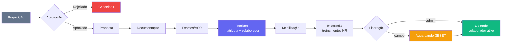

# Módulo RH — Admissão

> Esteira de admissão de ponta a ponta: da requisição de vaga até a liberação do colaborador para atividades. Kanban/lista de 9 etapas, com documentação, ASO, registro (contabilidade/matrícula), mobilização, treinamentos NR e a liberação final (com trava GESET para o pessoal de campo).

---

## Visão Geral

O módulo é a **máquina de estados** que leva um candidato de "vaga aberta" a "colaborador ativo". Cada requisição (`rh_admissoes`) carrega **N candidatos** (`rh_admissao_candidatos`) e atravessa 9 etapas. Ao chegar em **Registro**, o candidato vira efetivamente um `rh_colaboradores` (matrícula, contrato); ao chegar em **Liberação**, o cadastro é ativado e o Portal TEG é liberado.

Duas fontes alimentam a esteira:
1. **Manual** — RH cria a requisição pela tela (`Novo Registro`).
2. **Por e-mail** — um poller n8n lê a caixa `rh@teguniao.com.br` e cria a admissão automaticamente (ver [[10 - n8n Workflows]]).

> ⚠️ **Regra de negócio central — GESET.** A etapa **Liberação** tem dois sub-estados: **"Aguardando liberação"** (o candidato de campo depende da liberação do GESET) e **"Liberado"** (verde, concluído). O sub-estado vive em `rh_admissao_candidatos.dados_extras->>'geset_status' = 'aguardando_liberacao'`. Pessoal **administrativo não passa pelo GESET** e é liberado direto via `rh_admissao_liberar`.

---

## As 9 Etapas (`EtapaAdmissao`)

Ordem canônica definida em `RHAdmissao.tsx` (`ETAPAS[]`). O valor gravado em `rh_admissoes.etapa` é a `key`. Cada aba filtra por `etapa = key`.

| # | key (`rh_admissoes.etapa`) | Aba (label) | O que acontece |
|---|----------------------------|-------------|----------------|
| 1 | `requisicao` | Pendente | Requisição aguardando envio para aprovação |
| 2 | `aprovacao` | Aprovação | Diretoria autoriza a admissão (`status_aprovacao`) |
| 3 | `proposta_alinhamento` | Proposta | Proposta de contratação, aceite e alinhamento de chegada |
| 4 | `documentacao` | Documentação | Envio e conferência dos documentos do colaborador |
| 5 | `exames_treinamentos` | Exames | Exame admissional (ASO) — agendamento e resultado |
| 6 | `registro` | Registro | Ficha p/ contabilidade, contrato, **assinatura e matrícula** |
| 7 | `mobilizacao` | Mobilização | Logística de deslocamento e chegada à obra |
| 8 | `integracao` | Integração | **Treinamentos obrigatórios (NRs)** + onboarding RH/Gestor |
| 9 | `liberado` | Liberação | Colaborador apto, ativo e liberado para atividades |

Valor especial fora do fluxo: **`cancelada`** (requisição rejeitada antes da contratação). Requisições concluídas ou desligadas saem do board via `arquivada = true` (não usar `cancelada` para quem já foi registrado — ver [[52 - Módulo RH — Colaboradores]]).

**Sub-status derivado (`admStatus()` em `RHAdmissao.tsx`)** — o badge da linha não é `etapa` puro:
- `status_aprovacao = 'rejeitado'` → "Rejeitado"; `'esclarecimento'` → "Esclarecer"
- `etapa='liberado'` **e** algum candidato com `geset_status='aguardando_liberacao'` → **"Aguardando liberação"** (âmbar); senão → **"Liberado"** (verde)
- `etapa='integracao'` com GESET aguardando → "Aguardando liberação"; senão "Em integração"

---

## Páginas e Componentes

### `RHAdmissao.tsx` — `/rh/admissao`
Tela-mãe. Renderiza o rail de etapas (`ETAPAS`), a barra de filtros e o corpo (cards ou lista).
- **Visão Cards vs Lista** (`viewMode: 'cards' | 'list'`) com toggle. **Integração e Liberação abrem em Lista por padrão** (efeito no `etapa`), demais etapas em Cards.
- **Filtros:** Base (multi-select popover), Departamento (multi-select), Mês da solicitação, Urgência, Status. A aba **Liberação entra pré-filtrada em "Aguardando liberação"**.
- **`AdmissaoLista`** (tabela): colunas Candidato(s) · Base · CC · Docs · Status · **Admissão** · **Previsão**. **Linha vermelha** quando o colaborador está **> 13 dias do registro** (data de admissão), com selo `· Xd`. **Ordenação por clique no título** (todas as colunas). Admissão vem de `rh_colaboradores.data_admissao`; Previsão de `rh_admissoes.data_prevista_inicio`.
- **`AdmissaoLista` / cards** disparam `onSelect` → abre `RHAdmissaoModal`.
- Botões de ação por etapa (padrão): em Liberação, **"Liberado"** (aguardando → liberado) e **"Encerrar"**; ações no card e no modal.

### `RHAdmissaoEtapas.tsx`
Componentes de card por etapa (ex.: `DocumentacaoCard`, `LiberadoCandidato`, painéis de treinamento por candidato). Concentra a UI específica de cada estágio.

### `RHAdmissaoModal.tsx` / `RHAdmissaoForm.tsx`
Detalhe/edição da requisição e formulário de nova requisição (N candidatos, base, CC, cargo, tipo de contrato, urgência).

### `RHPainel.tsx` → `paineis/LiberacaoHeadcount.tsx`
**Painel de Liberação** (opção no dropdown do RHPainel). Lê a RPC `rh_admissao_liberacao_painel(p_de, p_ate)`:
- Indicadores: **Admitidos no período**, **Liberados** (só os verdes da etapa Liberação), **Tempo médio de integração** (registro→liberação).
- Pulso por etapa (barras verticais; Liberação conta só os "aguardando"), Fases por tempo (todas as 9 etapas), **Liberações em atraso** (dias = hoje − `data_prevista_inicio`).

---

## Hooks (`src/hooks/useRHAdmissaoFluxo.ts`)

| Hook | Responsabilidade |
|------|------------------|
| `useAdmissoesFluxo()` | Lista todas as requisições + candidatos (embed `colaborador(id,departamento,data_admissao)`) |
| `useBasesAdmissao()` | Bases para os selects |
| `useCriarAdmissao()` | Cria requisição com N candidatos (+ anexos) |
| `useTransicaoAdmissao()` | Move a requisição entre etapas |
| `useEditarAdmissao()` | Edita requisição + candidatos |
| `useEtapaCandidato(candidatoId)` | Carrega o "dossiê" do candidato (proposta, exame, treinamentos, mobilização, integração, registro) |
| `useEnviarMissaoDocs()` / `useMissoesDocsStatus()` / `useDocsRecebidos()` | Missões de documentação no Portal |
| `useUploadAnexoCandidato()` / `useExcluirAnexoAdmissao()` / `useAnexarDocMissao()` | Anexos (`rh_admissao_anexos`) |
| `useParecerQualificacao()` | Parecer CTPS × Matriz CEMIG |
| `useProposta()` | Proposta de contratação (`rh_admissao_proposta`) |
| `useAsoAgendar()` / `useAsoSetStatus()` | ASO (`rh_admissao_exame`) |
| `useTreinamentos()` / `useIntegracaoTreinos()` | Treinamentos (`rh_admissao_treinamentos`) |
| `useMobilizacao()` / `useMobApoio()` | Mobilização (`rh_admissao_mobilizacao`) |
| `useIntegracao()` | Integração/onboarding (`rh_admissao_integracao`) |
| `useRegistro()` | Registro/matrícula (`rh_admissao_registro`) |

Preencher ficha por IA: hook em `useRHAdmissaoFluxo`/modal chama o n8n `YZFpIDvz42JiAaUA` (Gemini) — baixa anexos → base64 → preenche campos.

---

## Schema do Banco

Prefixo: `rh_admissao_` (11 tabelas). A tabela-pai é `rh_admissoes`.

| Tabela | Descrição |
|--------|-----------|
| `rh_admissoes` | **Requisição** (1 por vaga). Campos-chave: `etapa`, `status`, `status_aprovacao`, `centro_custo_id`, `base` (text), `obra_prevista_id`, `cargo_previsto`, `departamento_previsto`, `tipo_contrato`, `salario_previsto`, `data_prevista_inicio`, `urgente`, `arquivada`/`arquivada_em`/`arquivada_por`, `tipo_movimentacao`, `colaborador_id`, `nome_candidato`, `cpf` |
| `rh_admissao_candidatos` | **N candidatos por requisição**. `dados_extras` (jsonb) guarda o `geset_status`. `colaborador_id` liga ao cadastro. Nas admissões novas o nome vive aqui (não em `rh_admissoes.nome_candidato`) |
| `rh_admissao_anexos` | Documentos por candidato / missão de assinatura (`tipo`, `arquivo_path`, `candidato_id`, `missao_assinatura_id`) |
| `rh_admissao_proposta` | Proposta de contratação / aceite |
| `rh_admissao_exame` | ASO — agendamento e resultado |
| `rh_admissao_registro` | Dados do registro (contabilidade/contrato) |
| `rh_admissao_mobilizacao` | Logística de chegada + tamanhos de uniforme (fonte do EPI) |
| `rh_admissao_integracao` | Onboarding/integração |
| `rh_admissao_treinamentos` | Treinamentos por candidato (`candidato_id`, `norma`, `status`, `certificado_path`/`certificado_nome`) — **≠** `qsma_treinamentos` (ver [[33 - Módulo SSMA]]) |
| `rh_admissao_pareceres` | Parecer de qualificação (CTPS × matriz) |
| `rh_admissao_historico` | Trilha de transições (`de_etapa`, `para_etapa`, `acao`, autor) — usada pelo painel para tempo por etapa |
| `rh_admissao_emails_processados` | Dedup do poller (`message_id`, `remetente`, `assunto`, `conversation_id`) |

**Escreve em outros módulos:** `rh_colaboradores` (cria/ativa o cadastro no Registro/Liberação).

---

## RPCs (SECURITY DEFINER)

| RPC | Papel |
|-----|-------|
| `rh_admissao_criar_via_email` | Cria a requisição a partir do e-mail (chamada pelo poller n8n) |
| `rh_admissao_email_registrar` | Registra/deduplica o e-mail em `rh_admissao_emails_processados` |
| `rh_admissao_ctps_dispara_parecer` | Gatilho: ao salvar CTPS, dispara o parecer CTPS × Matriz CEMIG (SuperTEG/Gemini) |
| `rh_admissao_parecer_salvar` | Grava o parecer de qualificação |
| `rh_admissao_enviar_missao_docs` / `rh_admissao_doc_anexar` / `rh_admissao_docs_recebidos` | Missões de documentação no Portal + anexação |
| `rh_admissao_aso_agendar` | Agenda/atualiza o ASO |
| `rh_admissao_reg_enviar_assinatura` / `_anexo` | Envia documentos do Registro para assinatura no Portal |
| `rh_admissao_finalizar_registro` | Conclui o Registro (matrícula/contrato) |
| `rh_admissao_mob_enviar_missao` | Missão de mobilização |
| `rh_admissao_int_enviar_missoes` / `rh_admissao_int_enviar_aceites` | Missões/aceites de integração |
| `rh_admissao_geset_status` | Seta o sub-status GESET no candidato |
| `rh_admissao_liberar` | **Liberação final** — ativa `rh_colaboradores` (`ativo`, `status_admissao`, base/cargo/CC), move para `etapa='liberado'`/`status='concluida'`, grava histórico e **dispara push de boas-vindas** |
| `rh_admissao_encerrar` | Encerra a requisição |
| `rh_admissao_liberacao_painel` | Alimenta o Painel de Liberação (indicadores, pulso, fases, atrasos) |
| `rh_admissao_push` | Push do Portal TEG ao candidato/colaborador |
| `rh_admissao_excluir` / `rh_admissao_anexo_excluir` | Exclusões |
| `rh_admissao_existe_aberta` / `rh_admissao_lookup_email` | Consultas auxiliares |
| `rh_admissao_assinatura_docs` / `_status` / `rh_admissao_aceites_status` / `rh_admissao_missoes_status` | Status de assinaturas/missões |

---

## Fluxo Principal

---

## Integração com Outros Módulos e Externos

| Alvo | Integração |
|------|-----------|
| **RH Colaboradores** | O Registro cria o `rh_colaboradores` (matrícula/contrato); a Liberação o ativa. Ver [[52 - Módulo RH — Colaboradores]] |
| **SSMA / Treinamentos** | Integração exige treinamentos NR; certificados do DOC GESET → `qsma_treinamentos`. Ver [[33 - Módulo SSMA]] |
| **DP / Ponto** | Após liberado, o colaborador passa a bater ponto (Secullum). Ver [[53 - Módulo DP — Ponto]] |
| **Portal TEG** (repo separado) | Missões de documentação/assinatura e push de boas-vindas via `rh_admissao_push` |
| **n8n** | Poller `rh@` ("RH - Admissao via Email"), Preencher Ficha AI (`YZFpIDvz42JiAaUA`), Parse Documento AI. Ver [[10 - n8n Workflows]] |
| **SuperTEG** | Parecer CTPS × Matriz CEMIG (qualificação) |
| **OneDrive (Graph)** | Ficha/documentos em `FICHAS E DOCUMENTOS FUNCIONÁRIOS TEG`; o assinado sobe automático na pasta do colaborador |

---

## Links Relacionados

- [[PILAR - RH]] — Pilar RH
- [[52 - Módulo RH — Colaboradores]] — Cadastro/headcount criado por este fluxo
- [[53 - Módulo DP — Ponto]] — Ponto após liberação
- [[33 - Módulo SSMA]] — Treinamentos NR e matriz por cargo
- [[10 - n8n Workflows]] — Poller de e-mail e IAs de preenchimento
- [[03 - Páginas e Rotas]] — Rotas do módulo
