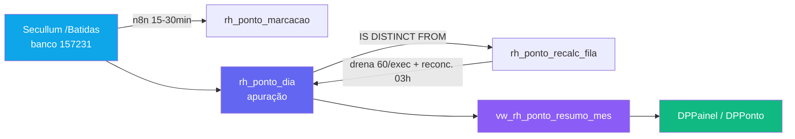

# Módulo DP — Ponto

> Espelho do **Secullum Ponto Web** dentro do Supabase. Traz as batidas e a apuração diária do relógio de ponto para dentro do TEG+, com HHt (Homem-Hora Trabalhada), horas extras, retificações, atestados e consolidação — vinculando cada hora a **base/centro de custo**.

---

## Visão Geral

O ponto **não é digitado no TEG+** — ele é batido no **Secullum** (banco `157231` — "TEG UNIAO"). Um sync n8n puxa periodicamente (15–30 min) do endpoint `/Batidas` e materializa duas camadas:
1. **`rh_ponto_marcacao`** — cada batida individual (com dispositivo, origem, NSR).
2. **`rh_ponto_dia`** — a **apuração diária** já calculada (1 linha por pessoa/dia): normais, faltas, extras 50/70/100, banco de horas.

Sobre isso, a view **`vw_rh_ponto_resumo_mes`** agrega por pessoa/mês e resolve **base** e **centro de custo**, alimentando a tela DP e os painéis.

> ⚠️ **HHt = só batida real.** O HHt usado nos painéis é `hh_real` = soma de `hh_trabalhada` **filtrando `FonteDados.Origem <> '2'`** (Origem 2 = inclusão/edição manual no cartão; 3 = REP físico; 16 = app). Isso exclui import/ajuste manual do volume de horas.

> ⚠️ **De onde vêm base e CC (crítico p/ os painéis):**
> - **Base** = `rh_colaboradores.base_id` (do **cadastro**), **não** do dispositivo.
> - **CC** = `COALESCE(rh_ponto_dia.centro_custo_id, rh_colaboradores.centro_custo_id)` — a view cai no CC do cadastro quando a batida não tem CC (correção feita em 2026-07; antes ~3.371h caíam em "Sem CC").
> - O **dispositivo → base** (`rh_ponto_linkdisp`) só define a flag `fora_base` e o filtro de dispositivo — não o agrupamento do HHt.

---

## Páginas e Componentes

### `DPPonto.tsx` — DP › Ponto (`DPFluxoPage`, 6 abas)

| Aba (key) | Conteúdo |
|-----------|----------|
| `registros` (Registros Ponto) | Grade de apuração por colaborador. Filtros: mês, base, **dispositivo**, pessoa, **situação Ativos/Inativos/Todos** (default **Ativos**), vista **Mês/Dia**, chips rápidos (REG_CHIPS) |
| `retificacoes` (Retificações) | Marcações manuais com motivo (`origem='2'` + `motivo`) — multiselect de justificativas |
| `horas_extras` (Horas Extras) | Dias com extra > 0 (view `vw_rh_ponto_hora_extra`) |
| `atestados` (Atestados) | Afastamentos (`rh_ponto_afastamento`) |
| `aprovacao` (Aprovação) | Fila de aprovação (pendente → em_aprovação → aprovado/reprovado) |
| `consolidacao` (Consolidação) | Fechamento do mês por colaborador |

### `DPPainel.tsx` — Painel do DP
Lê `usePontoResumoPeriodo(de, ate)` → view. Blocos: **HHt por Centro de Custo**, **Pontos em Aberto por Base**, **Horas Extras por Base**, indicadores (colaboradores ativos no ponto = pico de batedores/7d vs headcount ativo no de-para). "Sem CC"/"Sem base" aparecem quando o cadastro está incompleto (ver notas acima).

---

## Hooks (`src/hooks/usePonto.ts`)

| Hook | Responsabilidade |
|------|------------------|
| `usePontoResumoMes(anoMes, baseId?)` | Resumo por colaborador no mês (view) |
| `usePontoResumoPeriodo(de, ate)` | Agrega vários meses (Painel DP) |
| `usePontoDia(dataISO, baseId?)` | Visão diária — todas as marcações/apuração de um dia |
| `usePontoCartao(colaboradorId, anoMes)` | Cartão dia-a-dia de um colaborador |
| `usePontoRetificacoes(anoMes)` | Marcações `origem='2'` com motivo |
| `usePontoHorasExtras(anoMes, baseId?)` / `usePontoHorasExtrasPeriodo(de, ate)` | Dias com extra (view `vw_rh_ponto_hora_extra`) |
| `usePontoAtestados(anoMes)` | Afastamentos |
| `usePontoDispositivos()` | Dispositivos do de-para (`rh_ponto_linkdisp`) |
| `usePontoColabAtivos()` | Pico de batedores/7d vs headcount ativo |
| `useColabAtivosIds()` | Set de ids de colaboradores ativos (filtro situação) |
| `useEnviarItens()` | Envia itens para aprovação (pendente → em_aprovacao) |
| `useAprovarItem()` | Aprova/reprova um item |

---

## Schema do Banco

Prefixo: `rh_ponto_`. **`rh_ponto_dia` e `rh_ponto_marcacao` são PARTICIONADAS por mês** (`rh_ponto_dia_2026_07`, `_2026_08`, …).

| Tabela | Descrição |
|--------|-----------|
| `rh_ponto_dia` | **Apuração diária** (1 linha/pessoa/dia). Colunas: `data`, `secullum_func_id`, `colaborador_id`, `base_id`, `cargo`, `entrada1..saida2`, `normais`, `faltas`, `ex50/ex70/ex100`, `banco_saldo`, `centro_custo_id`, `projeto_id`, `departamento`, `aprov_status`, `raw` (jsonb com `EquipId*`, `FonteDados*`) |
| `rh_ponto_marcacao` | **Batida individual**. `nsr`, `data_hora`, `sequencia`, `tipo`, `origem`, `secullum_equip_id`, `motivo`, `aprov_status`, `raw` |
| `rh_ponto_linkcolab` | **De-para func → colaborador**. `secullum_func_id`, `colaborador_id`, `status`, **`depto_secullum` (= base do TEG+)** |
| `rh_ponto_linkdisp` | **De-para dispositivo → base**. `secullum_equip_id`, `descricao`, `base_id` |
| `rh_ponto_afastamento` | Férias / INSS / atestado (`inicio`, `fim`, `motivo`) |
| `rh_ponto_aprovacao` | Estado de aprovação |
| `rh_ponto_saldo_mes` | Banco de horas do mês |
| `rh_ponto_pendencia` | Batidas via app pendentes (com GPS) |
| `rh_ponto_recalc_fila` | **Fila de recálculo dirty-driven** (alimentada pelo sync via `IS DISTINCT FROM`) |
| `rh_ponto_sync_log` | Log de sincronização |
| `rh_ponto_aej_arquivo` | Arquivo AEJ fiscal |

**Views:**
| View | Descrição |
|------|-----------|
| `vw_rh_ponto_resumo_mes` | Agrega por pessoa/mês: `hh_real`, `extras_validos_real`, dias batidos/em aberto/fora de horário, banco. **Base = colaborador; CC = COALESCE(batida, colaborador); dispositivo predominante do mês + flag `fora_base`** |
| `vw_rh_ponto_hora_extra` | Dias com extra > 0 |

---

## Sincronização e Recálculo

- O **recálculo dirty-driven** (`rh_ponto_recalc_fila`) substituiu a rajada de `POST /Calcular` por funcionário, que travava o banco. Só recalcula o que mudou; RPCs set-based/changed-only, drena ~60/execução no n8n + reconciliação às 03h.
- O `depto_secullum` do Secullum **equivale à base do TEG+** — usado para validar/corrigir a base (o campo Estrutura do Secullum costuma vir vazio).

---

## Integração com Outros Módulos e Externos

| Alvo | Integração |
|------|-----------|
| **Secullum Ponto Web** | Fonte das batidas (endpoint `/Batidas`, `/Calcular`, `/FonteDados`). Ver [[45 - Mapa de Integrações]] |
| **n8n** | Workflow de sync (a cada 15–30 min) + drenagem da fila de recálculo. Ver [[10 - n8n Workflows]] |
| **RH Colaboradores** | `rh_ponto_linkcolab` liga func→colaborador; base e CC do HHt vêm do cadastro. Ver [[52 - Módulo RH — Colaboradores]] |
| **RH Admissão** | Colaborador só bate ponto após liberado. Ver [[51 - Módulo RH — Admissão]] |
| **Estrutura / CC** | `est_bases` (base) e `sys_centros_custo` (CC via cadastro) para agrupar o HHt |

---

## Armadilhas conhecidas (para evolução segura)

1. **Não confundir "base do dispositivo" com "base do HHt".** O painel agrupa por base do **colaborador**; o dispositivo só marca `fora_base`.
2. **Bater ponto não define admissão** — a `data_admissao` vem do cadastro/ficha, nunca da 1ª batida.
3. **Dispositivo sem de-para** (`rh_ponto_linkdisp.base_id` nulo) faz a batida ficar sem base — mas a apuração diária usa a base do colaborador, então o impacto é no relatório por dispositivo.
4. **Partições:** ao consultar histórico, lembrar que `rh_ponto_dia`/`_marcacao` são particionadas por mês.

---

## Links Relacionados

- [[PILAR - RH]] — Pilar RH (DP)
- [[52 - Módulo RH — Colaboradores]] — Cadastro que dá base/CC ao HHt
- [[51 - Módulo RH — Admissão]] — Colaborador entra no ponto após liberado
- [[45 - Mapa de Integrações]] — Secullum
- [[10 - n8n Workflows]] — Sync e recálculo
