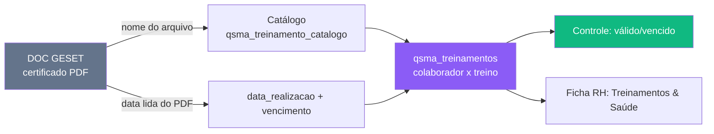

# Módulo QSMA — Matriz de Treinamentos

> Sub-módulo de **Segurança (SST)** do QSMA. Define **quais treinamentos cada cargo exige** (matriz) e **registra os treinamentos feitos por cada colaborador** com o certificado real anexado (OneDrive/DOC GESET), validade e vencimento. É o que trava/libera a integração na admissão e o que a ficha do colaborador mostra em "Treinamentos & Saúde".

---

## Visão Geral

Três tabelas formam o módulo:
1. **Catálogo** (`qsma_treinamento_catalogo`) — o dicionário de treinamentos (NRs e cursos CEMIG), com norma, carga horária e validade.
2. **Matriz** (`qsma_matriz_treinamento`) — para cada **cargo-base** × treinamento, se é **Obrigatório** ou **Não se aplica**.
3. **Realizados** (`qsma_treinamentos`) — o grid **colaborador × treinamento** com o certificado, data e vencimento.

> ⚠️ **Matriz é por cargo-BASE.** A matriz une os níveis de um cargo (ex.: "Montador I/II/III" → "Montador") via `cargoBase()` em `useQsma`. A exigência é **binária** (Obrigatório / Não se aplica).

> ⚠️ **Certificado — padrão dos 900+ registros:** `certificado_item_id` (id do item OneDrive) **+** `certificado_url` (webUrl SharePoint), com `certificado_path` **nulo**. Ao vincular um certificado novo, seguir esse padrão (id + url), não `path`.

---

## Páginas e Componentes

### `QsmaSeguranca.tsx` — QSMA › Segurança › Treinamentos (`/qsma`)
Primeira aba da Segurança, com duas sub-abas:
- **Matriz** — grade cargo-base × treinamento (Obrigatório / Não se aplica). Filtros multi-select; Escritório Central pode ficar de fora.
- **Controle** — grade colaborador × treinamento (ícones de status: válido / vencido / faltando), agrupada por função. Botão "ver" abre o certificado (`certificado_path`/`url`).

### Ficha do colaborador — bloco "Treinamentos & Saúde"
`RHColaboradorDetalhe` lê `qsma_treinamentos` e mostra os treinamentos com link do certificado (`certificado_url`). Ver [[52 - Módulo RH — Colaboradores]].

---

## Schema do Banco

Prefixo: `qsma_`.

| Tabela | Descrição |
|--------|-----------|
| `qsma_treinamento_catalogo` | Catálogo. `codigo`, `nome` (curso), `norma`, `carga_horaria`, `validade_meses`, `ordem`, `ativo` |
| `qsma_matriz_treinamento` | Exigência por cargo. `cargo`, `treinamento_id` → catálogo, `exigencia` (`obrigatorio`/…), `obs` |
| `qsma_treinamentos` | **Realizados por colaborador.** `colaborador_id`, `colaborador_nome`, `treinamento_id`, `norma`, `curso`, `carga_horaria`, `data_realizacao`, `validade_meses`, `vencimento`, **`certificado_item_id`** + **`certificado_url`** (+ `certificado_path` legado), `obs` |

### Catálogo atual (17 treinamentos)
`ASO` (NR-07, 12m) · `NR10B` NR-10 Básico (24m) · `NR10SEP` NR-10 Complementar/SEP (24m) · `NR11` Movimentação de Materiais (24m) · `NR12` Máquinas e Equipamentos (24m) · `NR18` Construção Civil (24m) · `NR31` Segurança Rural/Motosserra (24m) · `NR33` Espaço Confinado (12m) · `NR35` Trabalho em Altura (24m) · `DDL` Direção Defensiva Leves e Caminhonetes (120m) · `DDGP` Direção Defensiva Grande Porte (120m) · `P4X4` Pilotagem 4x4 (120m) · `CBSE` Curso Básico Supervisor/Encarregado (24m) · `MOTO` Utilização de Motosserra (24m) · `FAIXA` Limpeza de Faixa e Aceiro (24m) · `IF` Instrução Formal atividades não elétricas (24m) · `SINAL` Sinaleiro/Amarrador de Cargas (24m).

> ⚠️ **Direção Defensiva — leve vs grande porte:** a **matriz do cargo** decide. Motorista de Caminhão/Guindauto → **DDGP**; Técnico de Segurança/Engenheiro de Segurança → **DDL**. Confirmar sempre pelo próprio certificado ("VEÍCULOS LEVES" vs "LEVES E DE GRANDE PORTE").

---

## Como os certificados são vinculados (fonte de verdade)

Os certificados vivem no OneDrive, na pasta **DOC GESET** de cada colaborador (`FICHAS E DOCUMENTOS FUNCIONÁRIOS TEG/<NOME>/DOC GESET`). O **nome do arquivo identifica o treinamento** (ex.: `NR 18 Fulano.pdf`, `ACEIRO Fulano.pdf`, `Certificado Direção defensiva.pdf`). A **data de realização** (que define o vencimento = data + `validade_meses`) é lida **dentro do certificado** — vários são escaneados, exigindo render+leitura visual.

---

## Relação com a Admissão

Na esteira de admissão, os treinamentos ficam em **`rh_admissao_treinamentos`** (por `candidato_id`) — é a visão da **integração** (etapa 8). A **matriz do colaborador** (`qsma_treinamentos`) é a visão definitiva/permanente. Ao concluir a integração, os certificados do DOC GESET são vinculados em `qsma_treinamentos`. **Não confundir as duas tabelas.** Ver [[51 - Módulo RH — Admissão]].

---

## Integração com Outros Módulos

| Alvo | Integração |
|------|-----------|
| **RH Colaboradores** | Bloco "Treinamentos & Saúde" na ficha lê `qsma_treinamentos`. Ver [[52 - Módulo RH — Colaboradores]] |
| **RH Admissão** | Integração (etapa 8) exige os treinamentos NR; `rh_admissao_treinamentos` ↔ `qsma_treinamentos`. Ver [[51 - Módulo RH — Admissão]] |
| **SSMA (QSMA)** | Parte da Segurança/SST do módulo QSMA. Ver [[33 - Módulo SSMA]] |
| **OneDrive (Graph)** | Certificados no DOC GESET (`certificado_item_id`/`url`) |

---

## Links Relacionados

- [[33 - Módulo SSMA]] — Módulo QSMA (SST, MA, inspeções) — pai deste sub-módulo
- [[55 - Módulo QSMA — EPI, EPC e Ordem de Serviço]] — as outras matrizes por cargo (EPI, EPC) e a OS
- [[52 - Módulo RH — Colaboradores]] — Ficha Treinamentos & Saúde
- [[51 - Módulo RH — Admissão]] — Treinamentos na integração
- [[PILAR - RH]] — Pilar RH
