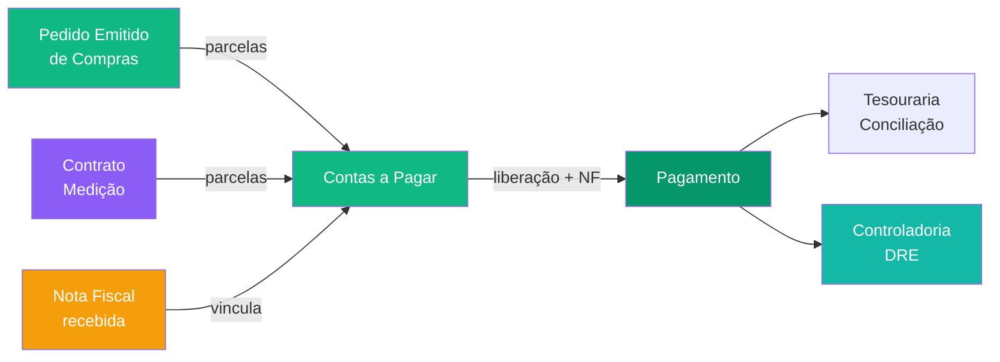

# 🔵 Pilar Backoffice

> Gestão financeira, fiscal, contratual e de controladoria.

---

## Módulos (5)

| Módulo | Completude | Doc principal |
|--------|-----------|---------------|
| **Financeiro** | 70% | [[20 - Módulo Financeiro]] |
| **Despesas** | Ativo | *(sub-módulo: cartões corporativos, adiantamentos)* |
| **Fiscal** | 80% | [[29 - Módulo Fiscal]] |
| **Controladoria** | 75% | [[30 - Módulo Controladoria]] |
| **Contratos** | 85% | [[27 - Módulo Contratos Gestão]] |

---

## Fluxo principal

---

## Docs detalhados

| Doc | Descrição |
|-----|-----------|
| [[20 - Módulo Financeiro]] | CP, CR, Tesouraria, pipeline |
| [[21 - Fluxo Pagamento]] | Liberação → NF → comprovante |
| [[27 - Módulo Contratos Gestão]] | 7 etapas, análise AI, medições |
| [[29 - Módulo Fiscal]] | Pipeline NF, SEFAZ |
| [[30 - Módulo Controladoria]] | DRE, orçamentos, KPIs, alertas |

## Integrações

- [[19 - Integração Omie]] — Futuro (~Jun 2026): lote pagamentos + conciliação
- [[45 - Mapa de Integrações]] — DocuSign (assinaturas), Bancos (CNAB/PIX)
- [[50 - Fluxos Inter-Módulos]] — Compras→Financeiro, Contratos→Financeiro

---

## Links

- [[00 - TEG+ INDEX]]
- [[PILAR - Suprimentos]] — Pedidos geram contas a pagar
- [[PILAR - Projetos]] — Obras geram adiantamentos
- [[50 - Fluxos Inter-Módulos]]
