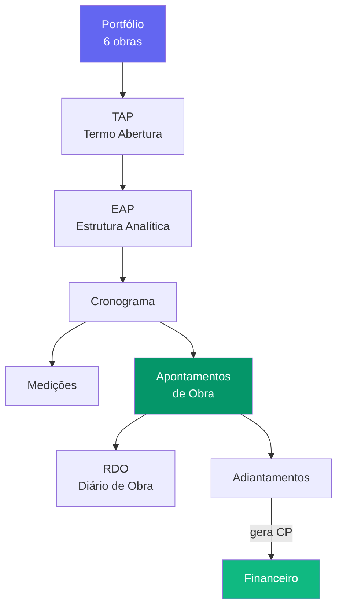

# 🟣 Pilar Projetos

> Gestão de portfólio, execução de obras e segurança do trabalho.

---

## Módulos (3 ativos + 1 planejado)

| Módulo | Completude | Doc principal |
|--------|-----------|---------------|
| **EGP (PMO)** | 80% | [[31 - Módulo PMO-EGP]] |
| **Obras** | 75% | [[32 - Módulo Obras]] |
| **SSMA** | 10% stub | [[33 - Módulo SSMA]] |
| **HHT** | ⬜ Q3 2026 | *(planejado — horas de trabalho)* |

---

## Fluxo principal

---

## Docs detalhados

| Doc | Descrição |
|-----|-----------|
| [[31 - Módulo PMO-EGP]] | Portfólio, TAP, EAP, cronograma, medições, histograma, custos |
| [[32 - Módulo Obras]] | Apontamentos, RDO, adiantamentos, prestação de contas |
| [[33 - Módulo SSMA]] | Stub — ocorrências, EPIs, checklists, treinamentos NR (Q2-Q4 2026) |

## Integrações

- [[50 - Fluxos Inter-Módulos]] — Obras→Financeiro (adiantamentos), PMO→Controladoria (orçamento)
- [[PILAR - RH]] — Apontamentos de HH alimentam RH

---

## Obras Ativas (6)

- SE Frutal
- SE Paracatu
- SE Perdizes
- SE Três Marias
- SE Rio Paranaíba
- SE Ituiutaba

---

## Links

- [[00 - TEG+ INDEX]]
- [[PILAR - Backoffice]] — Adiantamentos geram CP
- [[PILAR - Suprimentos]] — Obras consomem materiais
- [[PILAR - RH]] — Colaboradores alocados nas obras
- [[50 - Fluxos Inter-Módulos]]
