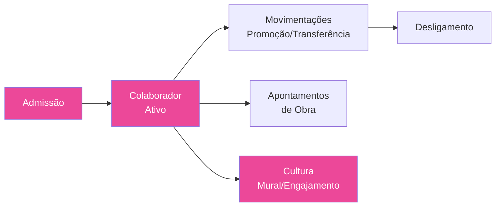

# 🟠 Pilar RH

> Gestão de pessoas: headcount, cultura organizacional e departamento pessoal.

---

## Sub-módulos (5)

| Sub-módulo | Status | Descrição |
|------------|--------|-----------|
| **Headcount** | ✅ Ativo | Admissão, colaboradores, movimentações, desligamento |
| **Cultura** | ✅ Ativo | Engajamento, clima, mural de recados |
| **R&S** | ⬜ Inativo | Recrutamento e seleção (Q2-Q3 2026) |
| **Performance** | ⬜ Inativo | Avaliações, metas, feedbacks (Q2-Q3 2026) |
| **DP** | ⬜ Inativo | Folha, ponto (Seculum), benefícios |

---

## Docs detalhados

| Doc | Descrição |
|-----|-----------|
| [[25 - Mural de Recados]] | Slideshow corporativo, gestão admin |
| [[28 - Módulo Cadastros AI]] | Cadastro de colaboradores com CPF lookup |

## Integrações futuras

- [[45 - Mapa de Integrações]] — **Seculum** (ponto eletrônico para DP)
- [[45 - Mapa de Integrações]] — **Nano Banana 3** (geração de imagem para endomarketing)

---

## Fluxo principal

---

## Links

- [[00 - TEG+ INDEX]]
- [[PILAR - Projetos]] — Colaboradores alocados nas obras
- [[PILAR - Backoffice]] — Folha/benefícios geram CP
- [[50 - Fluxos Inter-Módulos]]
