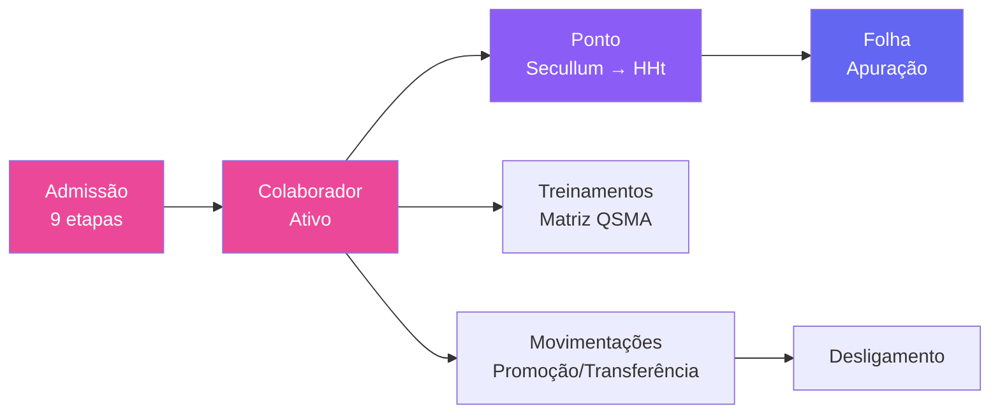

# 🟠 Pilar RH

> Gestão de pessoas: admissão (esteira de onboarding), headcount/cadastro, departamento pessoal (ponto/folha), treinamentos e cultura.

---

## Sub-módulos

| Sub-módulo | Status | Doc detalhado | Descrição |
|------------|--------|---------------|-----------|
| **Admissão** | ✅ Ativo | [[51 - Módulo RH — Admissão]] | Esteira de 9 etapas (requisição → liberação), GESET, painel |
| **Headcount / Colaboradores** | ✅ Ativo | [[52 - Módulo RH — Colaboradores]] | Cadastro-mestre, ficha, filtros, CC/base/departamento |
| **DP — Ponto** | ✅ Ativo | [[53 - Módulo DP — Ponto]] | Espelho do Secullum, HHt, extras, retificações |
| **DP — Folha** | ✅ Ativo | — | Apuração → verificação → fechamento → pagamento |
| **Treinamentos (matriz)** | ✅ Ativo | [[54 - Módulo QSMA — Matriz de Treinamentos]] | Matriz por cargo (QSMA), certificados do DOC GESET |
| **Cultura / Endomarketing** | ✅ Ativo | [[25 - Mural de Recados]] | Mural, engajamento |
| **R&S** | ⬜ Inativo | — | Recrutamento e seleção (futuro) |
| **Performance** | ⬜ Inativo | — | Avaliações, metas, feedbacks (futuro) |

---

## Fluxo principal

```mermaid
flowchart LR
    ADM[Admissão\n9 etapas] --> COL[Colaborador\nAtivo]
    COL --> PONTO[Ponto\nSecullum → HHt]
    COL --> TREIN[Treinamentos\nMatriz QSMA]
    COL --> MOV[Movimentações\nPromoção/Transferência]
    PONTO --> FOLHA[Folha\nApuração]
    MOV --> DES[Desligamento]

    style ADM fill:#EC4899,color:#fff
    style COL fill:#EC4899,color:#fff
    style PONTO fill:#8B5CF6,color:#fff
    style FOLHA fill:#6366F1,color:#fff
```

---

## Integrações externas

- **Secullum Ponto Web** (banco 157231) — ponto eletrônico → `rh_ponto_*` (ver [[53 - Módulo DP — Ponto]] e [[45 - Mapa de Integrações]])
- **OneDrive (Graph)** — fichas e documentos dos funcionários; certificados de treinamento
- **Portal TEG** (repo separado) — missões de documentação/assinatura e push
- **n8n** — poller de e-mail `rh@`, IAs de preenchimento de ficha, sync de ponto (ver [[10 - n8n Workflows]])
- **SuperTEG** — parecer CTPS × Matriz CEMIG

---

## Links

- [[00 - TEG+ INDEX]]
- [[51 - Módulo RH — Admissão]]
- [[52 - Módulo RH — Colaboradores]]
- [[53 - Módulo DP — Ponto]]
- [[33 - Módulo SSMA]] — Treinamentos, SST, Meio Ambiente
- [[PILAR - Projetos]] — Colaboradores alocados nas obras
- [[50 - Fluxos Inter-Módulos]]
