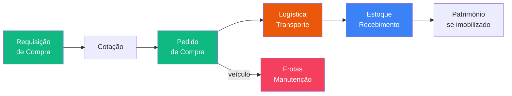

# 🟢 Pilar Suprimentos

> Cadeia completa de suprimentos: da requisição de compra à entrega no almoxarifado.

---

## Módulos (6)

| Módulo | Completude | Doc principal |
|--------|-----------|---------------|
| **Compras** | 95% | [[11 - Fluxo Requisição]] |
| **Logística** | 85% | [[23 - Módulo Logística e Transportes]] |
| **Estoque** | 65% | [[22 - Módulo Estoque e Patrimonial]] |
| **Patrimonial** | 60% | [[22 - Módulo Estoque e Patrimonial]] |
| **Frotas** | 85% | [[24 - Módulo Frotas e Manutenção]] |
| **Locação Imóveis** | 100% | [[34 - Módulo Locação]] |

---

## Fluxo principal

---

## Docs Compras

| Doc | Descrição |
|-----|-----------|
| [[11 - Fluxo Requisição]] | Wizard 3 etapas, RC-YYYYMM-XXXX |
| [[12 - Fluxo Aprovação]] | Token-based, 4 alçadas, multi-tipo |
| [[13 - Alçadas]] | Limites por valor e categoria |
| [[14 - Compradores e Categorias]] | 3 compradores, 12 categorias |
| [[26 - Upload Inteligente Cotacao]] | Parse AI de PDF/imagem |

## Integrações

- [[45 - Mapa de Integrações]] — Cobli (telemetria), Veloe (combustível), Consulta Placa
- [[49 - SuperTEG AI Agent]] — Parse de cotações via chat
- [[50 - Fluxos Inter-Módulos]] — Compras→Financeiro, Logística→Estoque

---

## Links

- [[00 - TEG+ INDEX]]
- [[PILAR - Backoffice]] — Financeiro recebe pedidos daqui
- [[PILAR - Projetos]] — Obras consomem materiais daqui
- [[50 - Fluxos Inter-Módulos]]
