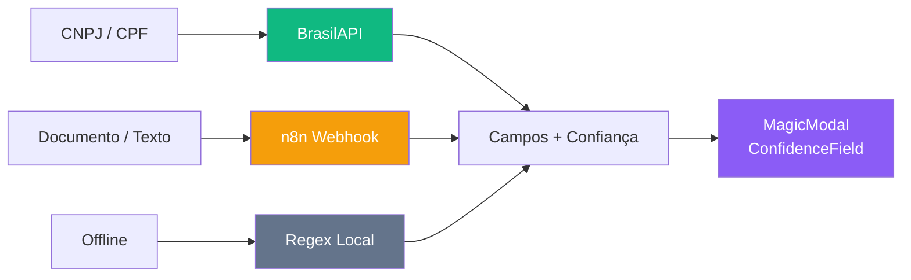

# ⚙️ Cadastros — Master Data Dashboard

> Painel centralizado de dados mestres do ERP. Gerenciado via módulo Cadastros (`/cadastros`).

---

## 📊 Entidades Master Data

| Entidade | Tabela | AI? | Status |
|----------|--------|-----|--------|
| Fornecedores | `cmp_fornecedores` | 🤖 CNPJ Lookup | ✅ Ativo |
| Itens de Estoque | `est_itens` | — | ✅ Ativo |
| Classes Financeiras | `fin_classes_financeiras` | — | ✅ Ativo |
| Centros de Custo | `sys_centros_custo` | — | ✅ Ativo |
| Obras / Projetos | `obras` | 🤖 AI Parse | ✅ Ativo |
| Colaboradores | `rh_colaboradores` | 🤖 CPF Lookup | ✅ Ativo |

---

## 🤖 Pipeline AI

---

## 📈 Componentes do Módulo

| Componente | Função |
|-----------|---------|
| `MagicModal` | Modal com toggle AI/Manual |
| `AiDropZone` | Drag-drop + CNPJ/CPF input |
| `ConfidenceField` | Input com indicador de confiança (emerald/amber/rose) |
| `CadastrosLayout` | Sidebar violet com 7 nav items |

---

## 🔗 Navegação

- [[28 - Módulo Cadastros AI]] — Documentação técnica completa
- [[Paineis/PAINEL PRINCIPAL|🏠 Painel Principal]] — Central de comando
- [[Paineis/Financeiro Dashboard|💰 Financeiro]] — Fornecedores e classes
- [[Paineis/Estoque Dashboard|📦 Estoque]] — Itens e inventário
